# AI-created animations

Which of the animations in `src/sample/` were made by an AI model, by which
model, and when. Each has a matching script in `tools/animations/` that
regenerates it. Dates are the date of the commit that added the file.

Frame counts: 24 unless noted; **53** is the measured device maximum.

The previews in `docs/gifs/` are rendered from the committed `.jt` files at
3x, with the real frame delays. Regenerate one after changing its script:

```sh
python3 tools/preview_jt.py src/sample/NAME.jt --gif docs/gifs/NAME.gif --scale 3
```

## Claude Fable 5

Created 2026-09-09. Sizes are 48 or 53 frames; the 53-frame entries land at
30,555 bytes -- the measured device maximum -- so send with
`--command-timeout 8`.

### Free choice

| Animation | Preview | Description |
| --- | --- | --- |
| `train` | 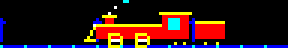 | A steam locomotive chuffing along: the engine holds the middle while telegraph poles scroll exactly one panel width, the drive wheels turn whole revolutions, and the chimney puffs smoke that fades white → cyan → blue as it drifts back over the cab. All three periods divide the loop. Seamless. 48 frames. |
| `eclipse` |  | A total solar eclipse, first contact to last: the moon crosses the disc, stars come out as coverage grows, totality is a black disc in a white-and-cyan corona, and the frames either side get the diamond-ring flash on the rim. Starts and ends on plain sun, so the wrap reads clean. 53 frames. |
| `lighthouse` | 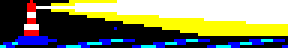 | A banded tower on rocks sweeping a wedge of light through a full circle each loop -- white core, yellow fringe -- washing out the stars where it passes, over a rolling sea. The lamp room flashes yellow as the beam faces out. Seamless. 48 frames. |
| `pinball` |  | A ball loose among three bumpers: sub-stepped physics ricochets it off walls and domes at constant speed, a struck bumper flashes white and rings outward, and each hit adds a score pip along the top wall. 53 frames. |
| `frogger` | 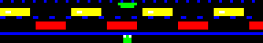 | One frog, two lanes of traffic: cars stream opposite ways while the frog waits on the verge for gaps, hops lane to lane up to the lily pad, and blinks a lap of honour. The hop frames are found by scanning the same traffic the frames draw, so it provably never shares a pixel with a car. 53 frames. |
| `popcorn` |  | Kernels over heat: a pan on a flickering element, yellow kernels jiggling and launching on staggered phases, each popping into a white starburst at the top of its arc before dropping back in. Seamless. 48 frames. |
| `lunar_lander` | 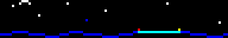 | A powered descent: gravity integrated every frame, scripted burns flaring under the hull to kill the velocity, touchdown between the pad marker lights, a skirt of dust rolling outward, and a green beacon once down. 53 frames. |
| `constellation` | 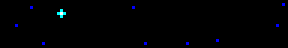 | The Big Dipper joined up: seven stars kindle one by one over a twinkling sky, cyan lines trace the bowl and handle segment by segment, the finished figure pulses, then fades back through blue to dark for the wrap. 53 frames. |

### Text-Em-All and personal

| Animation | Preview | Description |
| --- | --- | --- |
| `tea_poll` | 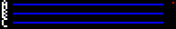 | Live text-poll results: three answer bars (A/B/C in a 3x5 mini-font, since the real font is too tall to stack) filling in bursts as votes arrive, each arrival pinging a white tick at the bar head, a red LIVE dot blinking throughout, and the winner flashing once the votes stop. 53 frames. |
| `tea_optin` | 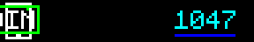 | The keyword opt-in flow: a green bubble slides out of a phone carrying JOIN, a check draws itself as the message lands, and the subscriber count on the right ticks up and flashes -- twice per loop, so the number visibly climbs. 53 frames. |
| `bug_hunt` | 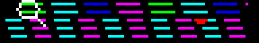 | Acceptance testing, dramatised: a magnifying glass sweeps rows of code line by line, locks onto a red bug scuttling along the middle row, squashes it flat, and the verdict comes up in a cleared window -- a green check and PASS. 53 frames. |

## Claude Opus 4.8

Created 2026-09-09. Every 53-frame entry lands at exactly 30,555 bytes -- the
measured proven-good maximum -- so send these with `--command-timeout 8`.

### Free choice

| Animation | Preview | Description |
| --- | --- | --- |
| `torus` |  | The shaded donut of donut.c on 96x16: a torus swept as (theta, phi) points, rotated on two axes, perspective-projected and z-buffered, each point lit by its surface normal and quantised into blue → cyan → white with a yellow specular tip. Turns once on one axis, twice on the other. Seamless. 53 frames. |
| `kaleidoscope` | 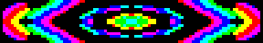 | The panel as a kaleidoscope tube: polar space folded into six mirrored wedges, filled by three drifting sine ripples in radius and folded angle, mapped onto SPECTRUM so the petals keep changing hue. Seamless. 48 frames. |
| `galaxy` | 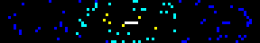 | A barred spiral: stars seeded onto two logarithmic arms plus a halo, the whole inclined disc rotating a full turn. Colour stands in for distance from the core -- white/yellow nucleus, cyan mid-disc, blue outer arms. Seamless. 53 frames. |
| `globe` | 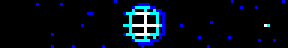 | A wireframe planet turning: a sparse lat/long grid on the near hemisphere, coloured by depth so the front rim reads white and curves back to blue at the limb. A moon swings around it on an inclined ellipse, over a scatter of fixed stars. Seamless. 53 frames. |
| `spirograph` |  | A hypotrochoid drawn by a pen in a rolling gear: the closed rosette hangs faint in blue while a bright comet head traces it, completing exactly one lap. Seamless. 53 frames. |
| `gears` |  | A meshing gear train: three toothed wheels counter-rotating at speeds set by their tooth counts, spokes making the rotation legible on so few pixels. Tooth ratios chosen so all three complete whole turns (2, 3, 4). Seamless. 48 frames. |
| `snow` | 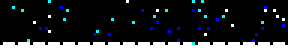 | Snowfall in three parallax layers, nearer flakes white then cyan then blue since the palette has no brightness to spare; each falls a whole panel height and sways whole cycles over the loop, above a thin snow bank. Seamless. 53 frames. |
| `breakout` | 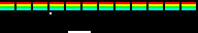 | Brick-breaker: coloured rows up top, a paddle that skates after the ball, and a ball whose sub-stepped physics ricochets off walls, paddle and bricks, knocking a hole through the wall. 53 frames. |
| `flappy` | 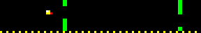 | A bird holding its column while green pipes stream past and wrap -- the world is a ring exactly as long as the scroll travels, so the pipes loop -- bobbing and flapping to thread each gap. Seamless. 53 frames. |
| `lightcycles` | 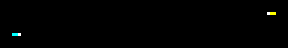 | The Tron derby: two bikes carve the grid at right angles into a tight spiral of light walls, until the yellow rider gets boxed in and crashes in a burst. 53 frames. |
| `breathing` | 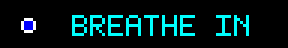 | A box-breathing coach: a ring on the left swells and dims through the GLOW ramp across four equal counts -- in, hold, out, hold -- while the instruction reads out beside it. Meant to be followed. Seamless. 52 frames. |
| `cassette` | 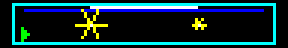 | A tape deck playing: the shell, a label strip, two spool hubs whose spokes turn, and the tape between them -- the left spool emptying as the right fills over the loop -- with a green PLAY marker in the corner. Seamless. 48 frames. |

### Text-Em-All and personal

| Animation | Preview | Description |
| --- | --- | --- |
| `tea_voice` | 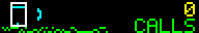 | The voice-broadcast half of Text-Em-All: a handset rings and shakes, fans out expanding sound arcs, and a live CALLS counter eases up to its total while a voice waveform jitters along the floor. 53 frames. |
| `deploy` | 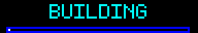 | A CI/CD pipeline shipping a build: a progress bar fills while the stage label steps BUILDING → TESTING → DEPLOYING, an activity pip running ahead of the fill, ending on SHIPPED with a flashing check. 53 frames. |
| `coffee` |  | A hot mug steaming -- three ribbons of steam rising and wavering from white through cyan, a little heart forming in them mid-loop. The universal "give me a minute". Seamless. 48 frames. |

## Claude Opus 5

Created 2026-09-09, all 24 frames. These were the first batch, written before
the 53-frame device maximum had been measured, so they were all built to the
24 frames the vendor's own packs use.

### Free choice

| Animation | Preview | Description |
| --- | --- | --- |
| `plasma` |  | Three interfering sine fields banded into the 8-colour palette; the quantization is the point, turning a smooth gradient into moving topography. Seamless. |
| `rain` | 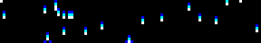 | Three-pixel streaks for motion blur, splashes on the floor, and one lightning strike where the sky fills blue for a single frame behind a white bolt. |
| `starfield` | 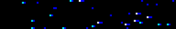 | Three parallax layers; speed and streak length both carry depth, since the palette has no brightness to spare. Seamless. |
| `fire` | 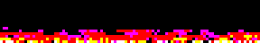 | Heat field rising and cooling through red-yellow-white, with sparse floor hotspots so tongues form instead of a slab. |
| `equalizer` | 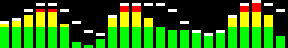 | Spectrum bars coloured by height like a real VU meter, peak markers on a slower wave so they lag. Seamless. |
| `sonar` |  | Rings expanding on a horizontally stretched ellipse, age setting the colour. Seamless. |
| `matrix` | 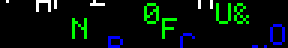 | Font glyphs cascading, each column at its own speed, the character changing as it falls. |
| `hazard` | 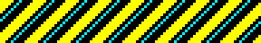 | Diagonal warning stripes from `(x + y + offset) mod period`, with cyan pinstripes. Seamless. |
| `helix` | 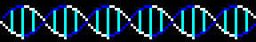 | Two strands a half-period apart; the front one is drawn white and they swap at each crossing, so the ladder reads as twisting. Seamless. |
| `metaballs` |  | Inverse-square fields summed and thresholded into contour bands, so blobs bulge toward each other and fuse. Seamless. |
| `snake` | 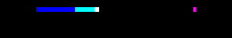 | A serpentine route whose length divides the frame count, so it closes exactly; body fades back from the head, pellet always just ahead. |
| `wave` | 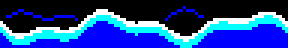 | Two sine components summing into a crest that changes shape rather than sliding, with a reflection above the surface. Seamless. |

### Text-Em-All and personal

| Animation | Preview | Description |
| --- | --- | --- |
| `tea_broadcast` | 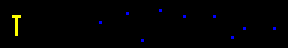 | One sender, wavefronts sweeping right, recipients turning green as each is reached, then all pulsing together. |
| `tea_wordmark` |  | TEXT-EM-ALL with a shine passing over it. Deliberately plain — a name is the one thing on a sign that should not be hard to read. |
| `tea_delivered` | 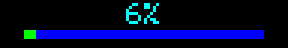 | A percentage counting up with a filling bar, then SENT and a tick. |
| `chaos_corner` | 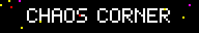 | The sign's own name, steady while the margins misbehave: sparks, glitched letters, the odd bad-connection streak. |
| `konami` |  | The code entered one input at a time, then flashing green. Guessed at from the Pac-Man, Animal Well and party parrot files already in the repo. |

### Later reworked by another model

Both were created here and have since been changed; see
[Reworked, not created](#reworked-not-created) for what changed. Note the
previews below show the *current* files, since previews are rendered from
what is committed — not the versions described in the last column.

| Animation | Preview | As created |
| --- | --- | --- |
| `dcc_new_achievement` | 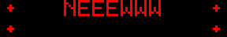 | "Neeewwww achievement" in the narrator's voice, two beats: a highlight sweeps the top line, then the bottom lights up left to right as the payoff. 24 frames at 230ms, yellow on blue. |
| `life` | 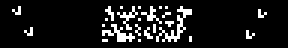 | Conway's Life on a 96x16 torus, four gliders fired into random soup, cells coloured by age so you can see where the computation is still happening. 24 generations, seed 11. |

Not in these tables: `column_markers.jt`, a single-frame diagnostic from the
same session that renders red, green, blue, white across the first four
columns and green, red in columns 95-96. It has no script in
`tools/animations/` because it was generated ad hoc to catch plane and column
misalignment, which is what it was for.

## Claude Opus 4.7

Created 2026-09-09.

### Free choice

| Animation | Preview | Description |
| --- | --- | --- |
| `slot_machine` | 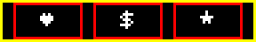 | Three reels spin random symbols, lock left-to-right onto 7 7 7, then the cabinet border strobes gold/red for the jackpot. |
| `sunrise` | 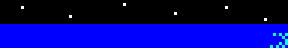 | A full day/night cycle: sun arcs across, moon rises on the opposite side, sky flushes red at the horizon at the extremes, water shimmers under whichever body is up. Seamless. 53 frames. |
| `pipes` | 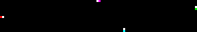 | The Windows 95 screensaver on a 96x16: four coloured pipes grow one segment per frame with an 18% turn chance, respawning on collision. Wipes on the last frame so the loop is clean. 53 frames. |
| `hyperspace` |  | Radial starfield with geometric acceleration; each star draws a streak from its previous position to its new one, colour stepping blue → cyan → white with distance. Ends in a warp flash. |

### Text-Em-All and personal

| Animation | Preview | Description |
| --- | --- | --- |
| `retro_pager` |  | The sign as an amber pager LCD: idle "TEXT-EM-ALL" branding, then a buzz (shake + flashing red LEDs), then "HI HUMBERTO" typed one letter at a time with a blinking cursor, ending on a pulsing heart. A nod to Text-Em-All's roots in mass messaging. |
| `campaign_sent` | 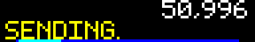 | A broadcast counter easing from 0 to 250,000 with a filling progress bar and a "SENDING..." label that flips to "SENT!" with a check when the count settles. |

## Claude Fable 5.1

Created 2026-09-09.

### Free choice

| Animation | Preview | Description |
| --- | --- | --- |
| `lorenz` |  | The Lorenz attractor tracing itself, oldest path blue, head white; the tail expires so it never fills to a slab. 53 frames. |
| `julia` |  | Julia set morphing as c circles the origin; seamless. 53 frames. |
| `tunnel` |  | Demoscene checkered-pipe flythrough; parity kept even so it loops. |
| `lissajous` | 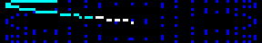 | 3:2 Lissajous figure turning in phase, sparse blue ghost, comet running two laps. |
| `cubes` | 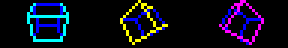 | Three wireframe cubes tumbling with perspective, blue back-edges. |
| `rule30` |  | Wolfram's rule 30 from a single seed, two generations a frame, scrolling up. |
| `orbit` |  | Five planets with integer periods passing behind and in front of the sun. |
| `heartbeat` | 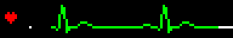 | ECG monitor sweep with a blank gap ahead of the cursor; the heart beats on each spike. |
| `fireworks` |  | Eight shells, particles cooling through three colours, two-shell finale. 53 frames. |
| `lightning` | 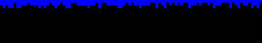 | Random-walk bolts with afterglow; one flickers. |
| `bounce` | 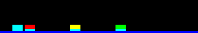 | Balls with periods 12/8/6 that realign once per loop, squash frame, shadows. |
| `pong` | 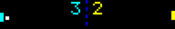 | Four crossings, then the left player misses and the score ticks over. 53 frames. |
| `tetris` | 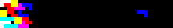 | Sideways, gravity left, on a board built from real tetrominoes; six pieces drop in, two rotate in flight and one is steered, five columns clear. Sequence found by search. 53 frames. |
| `invaders` | 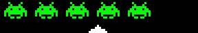 | The 1978 crab marching, legs alternating; the cannon shoots one. |
| `rocket` | 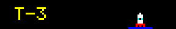 | T-3 countdown, flame, smoke, LIFTOFF. |
| `eyes` |  | A pair of eyes: glances, blinks, a thinking look, a sideways squint. 53 frames. |
| `flag` |  | Rainbow flag rippling on a pole, amplitude growing from the hoist. |
| `hourglass` | 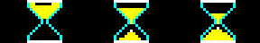 | Three hourglasses out of phase; sand drains, then a card-flip turns each over. |
| `aquarium` | 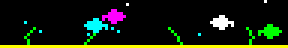 | Fish both ways with tail flicks, bubbles, swaying weed; seamless. 53 frames. |
| `pendulum_wave` | 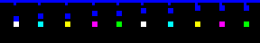 | Ten bobs end-on at consecutive whole cycles per loop: line, wave, chaos, line. 53 frames. |
| `night_drive` | 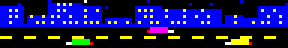 | Skyline with flickering windows, stars, cars passing both lanes; seamless. 53 frames. |
| `dominoes` |  | Sixteen tiles tipping in turn, each reaching the next as it starts to go. 53 frames. |
| `newtons_cradle` |  | One sine drives both end balls; the middle three hold and flash on the click. 53 frames. |
| `sorting` |  | Bubble sort on 24 bars, swaps sampled to fit, then the green done-sweep. 53 frames. |
| `donut_dvd` |  | The bouncing DVD logo as a donut; triangle-wave path so it loops seamlessly despite 53 being prime, grazing a corner by one pixel. 53 frames. |
| `clawd` |  | The Claude Code mascot trots in, blinks at a prompt with a blinking cursor, trots off. 53 frames. |

### Text-Em-All and desk statuses

| Animation | Preview | Description |
| --- | --- | --- |
| `rebrand` |  | CALL-EM-ALL flips letter by letter into TEXT-EM-ALL, then a shine. |
| `sms_bubbles` |  | A texting thread: outgoing green, incoming blue, typing dots, scroll. |
| `tests_passing` |  | Sixteen specs run; one fails red, retries, passes; ALL 16 PASS. |
| `pairing` |  | Bluetooth SEARCHING... then CONNECTED with a tick. |
| `status_on_a_call` |  | Rattling handset, ON A CALL in red, blinking dot. |
| `status_focus` |  | Headphones with a small equaliser, FOCUS MODE with a shine. |
| `status_brb` |  | BE RIGHT BACK while a stick figure walks off the right edge. |
| `humberto` |  | The name at 2x font, letters dropping in, then a rainbow ripple. |
| `sgla_welcome` |  | For the Small Giants Leadership Academy graduation visit: WELCOME / SGLA, CONGRATS, / Y'ALL! with a tossed mortarboard, CLASS OF 2026, under confetti. 53 frames. |

### Dungeon Crawler Carl

All 53 frames, red and yellow after the book covers.

| Animation | Preview | Description |
| --- | --- | --- |
| `dcc_loot_box` |  | A chest rattles, the lid lifts, light fans out, GOLD BOX! |
| `dcc_boss_battle` |  | WARNING, then BOSS BATTLE with a red-eyed skull and a strobing border. |
| `dcc_collapse` |  | COLLAPSE IN over a real-time ten-second countdown, red bars closing in. |
| `dcc_level_up` |  | XP bar fills, 27 rolls up and 28 slides in, LEVEL UP! |
| `dcc_goddammit_donut` |  | Typed out with a cursor while Donut blinks, flicks an ear and swishes her tail. |
| `dcc_followers` |  | A live follower count with a heart that beats on each batch. |

### Dungeons & Dragons

All 53 frames.

| Animation | Preview | Description |
| --- | --- | --- |
| `d20_nat20` |  | A wireframe icosahedron tumbles in and stops; the near face fills gold, NAT 20! |
| `d20_nat1` |  | The same roll from the same code, landing on 1: red face, CRIT FAIL. |
| `dnd_fireball` |  | Eight 5x5 d6 tumble and settle under FIREBALL!, total counts to 34. |
| `dnd_dragon` |  | A dragon beats its wings, breathes a cone of fire, then ROLL INITIATIVE! |
| `dnd_hp` |  | A hit-point bar taking damage in chunks, one heal, ending at 3/58. |

### Round two

Created 2026-09-10, from a list of prompts treated as inspiration. All 53 frames.

| Animation | Preview | Description |
| --- | --- | --- |
| `can_it_run_doom` |  | The question, a first-person corridor with an imp closing in, a shotgun blast, and YES. IT RUNS DOOM. |
| `portal` |  | A companion cube slides into the orange portal and out of the blue one; one crossing per loop, seamless. |
| `eye_of_sauron` |  | A wide ellipse of flickering fire with a black slit pupil sweeping side to side; the sweep is seamless. |
| `amaze` |  | Rocky from Project Hail Mary taps a leg while notes rise: AMAZE, AMAZE, AMAZE, then FIST MY BUMP. |
| `peek` |  | Dark panel. A cat's outline rises from the bottom edge and looks around; later a ghost drifts in from the right. |
| `team_name` |  | DONUT HOLES flips out letter by letter and WAFFLING DONUT$ flips in, the donut icon becoming a waffle. |
| `dftba` |  | D F T B A across the top; each lights gold as its word appears below, ending on AWESOME. |
| `hamilton_shot` |  | The star, I AM NOT / THROWING AWAY word by word, then MY SHOT at double size with sparks. |
| `hamilton_duel` |  | The count to ten with big digits, two duellists, a white flash, one pistol raised to the sky, THE WORLD WAS WIDE ENOUGH. |
| `key_quest` |  | A DFS-carved maze; an explorer follows the shortest path to a blinking key, leaving a cyan trail, and the exit door opens. |
| `triforce` |  | Three golden triangles spin in from off-panel and lock into the Triforce, pulse white, then a diagonal shine. |
| `bios` |  | A power-on self test two lines at a time: memory counting to 640K OK, keyboard OK, boot to a blinking C:\> prompt. |
| `pigeon` |  | A pigeon flaps across with an envelope, drops it into a mailbox, and the flag pops up red. |
| `rooftop` |  | A cosy terrace at night: string lights twinkling, a skyline, moon, chairs, a flickering lantern, swaying plants. Seamless. |
| `signal` |  | Static resolves into a trace with pulses in groups of 2, 3, 5, 7, 11; the numbers appear, then the noise returns. |
| `the_door` |  | A door outline in the dark opens slowly, light spilling out around a silhouette; it slams, and two red eyes open. |
| `riddle` |  | I HAVE 1536 EYES / AND ONLY 8 COLORS, I SPEAK IN FRAMES / 53 AT A TIME, I NEVER SLEEP / WHAT AM I? Then every colour, then ME. |
| `waldo` |  | A crowd in random colours; a magnifying ring pauses on suspects and lands on the one in red and white stripes, who waves. |

### Reworked, not created

These existed before; Fable 5.1 changed them on 2026-09-09. The original
author should list them under their own model.

| Animation | Preview | Change |
| --- | --- | --- |
| `dcc_new_achievement` |  | 24 frames at 230ms to 53 at 100ms; yellow-on-blue to red and yellow. |
| `life` |  | 24 generations to 53; seed 11 to 16, chosen as the one still busiest at the end. |

## Claude Opus 4.6

Created 2026-09-09, all 53 frames.

### Free choice

| Animation | Preview | Description |
| --- | --- | --- |
| `aurora` |  | Northern lights: overlapping sine waves drive curtain height and sway, GLOW brightness from leading edge up, hue drifting across the width via SPECTRUM. Seamless. 53 frames at 120ms. |
| `maze` |  | Recursive backtracker carving a 48×8-cell maze in real time. Blue walls, black passages, white carver head with a cyan trail. 53 frames at 80ms. |
| `ripples` |  | Seven staggered water drops sending concentric ring ripples that interfere constructively; brightness quantized through the GLOW ramp. Seamless. 53 frames at 80ms. |
| `flock` |  | ~30 boids with cohesion, separation, and alignment rules swarming as a murmuration; density-based coloring (white clusters, cyan medium, blue sparse). 53 frames at 90ms. |
| `sand` |  | Falling-sand simulation: colored grains drop from random positions and pile up following diagonal-slide physics. 53 frames at 80ms. |
| `fireflies` |  | ~12 fireflies drifting over an irregular green grass silhouette, each pulsing independently through the GLOW ramp. Seamless. 53 frames at 120ms. |
| `waveform` |  | Oscilloscope: a three-sine composite waveform morphing each frame, blue dot grid, dashed center line, phosphor persistence trail fading green → cyan → blue. Seamless. 53 frames at 60ms. |
| `coral` |  | Diffusion-limited aggregation growing branching coral structures from the bottom up; growth front white, recent cyan, established blue. 53 frames at 100ms. |

### Text-Em-All

| Animation | Preview | Description |
| --- | --- | --- |
| `tea_heartbeat` |  | Company pulse: a beating heart glyph synced with a messages-per-second counter, "TEA" steady in the center. 53 frames at 100ms. |
| `tea_network` |  | Mass messaging as a network effect: one sender's message cascades exponentially through four columns of recipients, each generation a different color, ending with a synchronized pulse. 53 frames at 90ms. |
| `tea_uptime` |  | Service uptime monitor: "99.99%" types in, a 30-day status row fills (mostly green, a couple yellow), then "ALL SYSTEMS GO" wipes in. 53 frames at 100ms. |
