# AI-created animations

Which of the animations in `src/sample/` were made by an AI model, by which
model, and when. Each has a matching script in `tools/animations/` that
regenerates it. Dates are the date of the commit that added the file.

Frame counts: 24 unless noted; **53** is the measured device maximum.

The previews in `docs/gifs/` are rendered from the committed `.jt` files at
3x, with the real frame delays. Regenerate one after changing its script:

```sh
python3 tools/preview_jt.py src/sample/NAME.jt --gif docs/gifs/NAME.gif --scale 3
```

## Claude Opus 5.5

Created 2026-09-23, all 53 frames at 30,555 bytes -- the measured device
maximum -- so send these with `--command-timeout 8`.

### Free choice

| Animation | Preview | Description |
| --- | --- | --- |
| `chess_mate` | 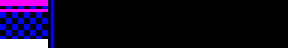 | Scholar's mate on a real 8x8 board at 2px a square, which is exactly the panel's 16 rows. Each piece lifts off a green-highlighted square and slides into place while the move list (1.E4 E5 ... 3.QH5 NF6?? 4.QXF7#) writes itself on the right and scrolls up; then the black king's square blinks red under a flashing CHECKMATE. |
| `traffic_wave` | 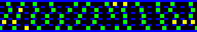 | Five ring-road lanes, each running a seeded Nagel–Schreckenberg traffic model, cars coloured by speed: green cruising, yellow slowing, red stopped. One driver brakes (flashing white), and the red knot that follows drifts backwards against the traffic even though every car in it keeps moving forward. |
| `langtons_ant` | 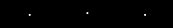 | Three Langton's ants in yellow, cyan and magenta on the wrapping 96x16 panel, starting at 3 steps a frame so their first scribbles can be followed, then speeding up as the patches grow and collide. Any ant treats any painted cell as painted, so they repaint and erase each other's trails. |
| `waggle_dance` | 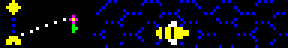 | A striped forager on a dotted honeycomb dances one full figure eight in exactly 53 frames: a buzzing, shaking straight run 70° from vertical, then a loop back, alternating right and left. On the left a hive, the sun and a flower 70° round show what the dance means; the dotted line to the flower marches while she waggles. |
| `mitosis` | 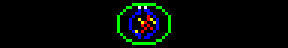 | A cell divides: chromatin condenses into four X-shaped chromosomes, the envelope breaks into dots, centrosomes move apart, spindle fibres line the chromosomes up, then each X splits into chevrons pulled to the poles and two daughter nuclei form. The membrane is a two-point metaball field, so it pinches into a peanut and splits by itself, with no furrow drawn. |
| `washing_machine` |  | A front-loader: a red sock, blue shirt, yellow towel and magenta pants tumble through cyan water with rising bubbles, the drum reversing halfway. Then SPIN: each item becomes an arc along the drum wall whose length grows with speed -- motion blur in 3 bits -- the cabinet walks side to side, and the readout climbs to 1400 RPM before it slows and refills. |
| `bit_order` | 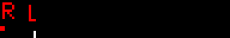 | The sign's own storage order, made visible. A landscape is painted exactly as the `.jt` stores it: a scan head walks each column top to bottom, about 93 bits a frame, first the red plane alone, then green over it (reds turn yellow), then blue to complete all 8 colours. An R/G/B label tracks the plane, and the finished picture holds under a tick. |
| `double_slit` | 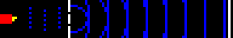 | A red emitter fires single photons at a barrier with two slits; faint wavefronts spread beyond, and each photon lands as a flash on the detector at a row drawn from a seeded cos² × sinc² two-slit distribution. Hits stack into a histogram growing leftward from the screen, and as the rate ramps up, bright fringes with dark rows between emerge from the noise. |
| `seismograph` | 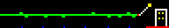 | A drum recorder: paper scrolls left under a pivoting pen, a quiet line gives way to fast P-waves, then S-waves swinging nearly the full 16 rows and a decay, while a little building sways (roof further than base) and a readout climbs to M6.8. The paper pattern repeats every loop with the quake only in the part frame 0 never shows, so the record scrolls off and the loop is seamless. |
| `timelapse_garden` | 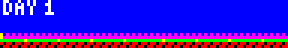 | Five days in a flower bed: the sun arcs over a blue sky with a magenta band at dawn and dusk, a crescent moon crosses a starfield, and plants grow only while it is light -- seed, sprout, leaves, bud, bloom, eight colours of flower -- with a DAY counter in a 3x5 mini-font. Ends in full bloom on the last night. |

### Memes, 2015 to 2024

| Animation | Preview | Description |
| --- | --- | --- |
| `the_dress` | 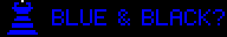 | (2015) A striped dress flips between BLUE & BLACK? and WHITE & GOLD?, each reading held a little shorter than the last until it flickers every frame; then a magenta seam splits it into both readings at once, both captions stacked. |
| `drake` | 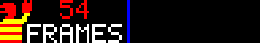 | (2015) Drakeposting laid side by side: an orange-jacketed figure turns away with a raised palm from 54 FRAMES, which gets struck through, then grins and points at 53 FRAMES with a green tick. A sign in-joke -- 53 is the hardware maximum, and 54 transfers "successfully" but is silently ignored. |
| `distracted_boyfriend` | 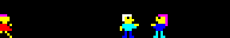 | (2017) A woman in red walks in and the boyfriend's head whips round to follow while his body stays turned to his girlfriend, whose face flushes under a scowl and an anger mark. Then the labels land -- LED SIGN, ME, MY JOB -- in a hand-built 3x5 mini-font so ten rows are left for the figures. |
| `galaxy_brain` | 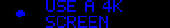 | (2017) Four stages, each brain bigger and brighter: USE A 4K SCREEN, USE AN LED SIGN, ONLY 96X16 PIXELS, 8 COLORS IS PLENTY. The glow climbs the palette's only ramp, BLUE → CYAN → WHITE, and the last brain blazes with shock-waves of light rolling out across the panel. |
| `bongo_cat` | 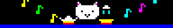 | (2018) The round white cat slaps the bongos left, right, left, right; each hit flashes the rim, throws impact marks and sends a coloured note drifting up. A pause with paws raised, then both at once with happy ^ ^ eyes. Notes are simulated modulo the loop, so it has no seam. |
| `thanos_snap` | 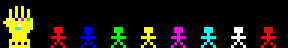 | (2018) The gauntlet's stones glint in turn, fingers snap, the panel whites out and a shockwave crosses eight little heroes -- then four come apart pixel by pixel, each on its own seeded schedule, drifting up and right as ash cooling yellow → red → magenta → blue. PERFECTLY, then BALANCED. |
| `crab_rave` | 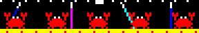 | (2018) Five red crabs dance on a 4-frame beat -- about 125 BPM -- claws pumping and sidestepping in sync under disco beams that go solid on the downbeat. The middle three burrow into the sand, BUGS IS GONE appears framed by the two that stay, and the three dig back up for the loop. |
| `among_us` | 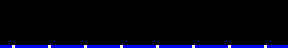 | (2020) A red crewmate (bean body, cyan visor with a glint, backpack) walks in and SUS lands beside it at double size. Cut to space: the ejected body tumbles a quarter turn every two frames across a three-speed parallax starfield, then RED WAS NOT / THE IMPOSTOR. types out over the stars. |
| `wordle` | 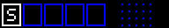 | (2022) The current guess in five big tiles on the left, the share grid building on the right. Each tile squashes, changes colour and springs back in turn; STORM, CRANE, NAVEL, PANEL are coloured by a real Wordle scoring function, duplicate-letter rules included. The winning row hops in a wave, then SPLENDID. |
| `moo_deng` | 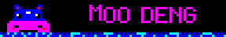 | (2024) The baby pygmy hippo face-on in her pool -- wet-shine head, wide pink muzzle, blushing cheeks -- bouncing with a splash at each landing while MOO DENG ripples. She rears up and chomps three times (CHOMP!), then a big hop sprays water for BOUNCY PIG. |

### Joy

Created 2026-09-23 for a request for something that makes people want to run
through a wall -- the feeling `wednesday_frog` got when it went up on a
Wednesday. Not all share its build-up-then-shake shape; the brief was the
delight, not the structure.

| Animation | Preview | Description |
| --- | --- | --- |
| `oh_yeah` | 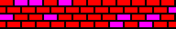 | A brick wall trembles in rumbles while cracks spread white-hot from one point. A white flash, the grinning red pitcher bursts through, and each brick holds until the shockwave from the impact reaches it, then flies off as its own particle. OH YEAH! slams in at double size, strobing, the whole panel shaking. |
| `over_9000` | 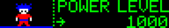 | (2006) A spiky-haired fighter powers up as the scouter climbs from POWER LEVEL 1000, his aura going BLUE → CYAN → WHITE → YELLOW with rocks floating up; the hair turns gold as the reading hits exactly 9001. The scouter pops in a white flash and IT'S OVER, then 9000!!!, scream in at double size. The aura keeps a one-pixel black gap round him so he reads whatever its colour. |
| `leeroy_jenkins` | 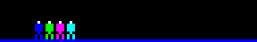 | (2005) Four adventurers huddle while the plan types out -- 32.3333... running off the panel, (REPEATING) -- then a gold paladin wanders in late: OK LET'S / DO THIS. He charges across the panel in seven frames trailing dust, ! marks pop over the party, the name stretches out a letter a frame to LEEEEROY, and JENKINS!!! slams in shaking. |
| `this_is_sparta` | 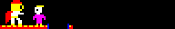 | (2007) A red-crested Spartan faces a messenger at the edge of a pit: MADNESS?, then THIS, then IS. A white flash, the kick, and the messenger hangs over the pit for a cartoon beat beside a "!" before he drops -- then SPARTA!!! fills the panel at double size, strobing red, yellow and white, the Spartan bobbing in triumph. |
| `hype_meter` | 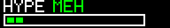 | A segmented HYPE gauge climbs through MEH, OK, HYPED and UNHINGED, green to yellow to red, rattling harder as it rises until segments burst out past the end of the box. A white flash, a spark blast, then LET'S drops in at double size and bounces, and GOOOO!!! follows an O at a time under a rain of sparks. |
| `zoomies` | 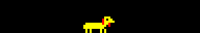 | A yellow dog wagging in the middle of the panel gets a "!" and bolts: edge to edge and back, faster every lap (7 up to 23 px a frame), skidding at each wall in a spray of dust, trailing blue and cyan motion-blur copies while ZOOMIES! strobes overhead. Then it flops on its belly, tongue out, tail going, and hearts float up. |
| `letters_dance` | 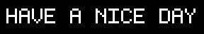 | HAVE A NICE DAY in plain white, the most boring sign in the building -- until the C twitches, the Y glances over its shoulder, and they all break loose: a travelling wave, then a rainbow conga line that snakes off one edge and back in the other, each letter pirouetting. They scramble home and freeze, perfectly still, except the A, which landed upside down. No shake; the surprise is the joke. |
| `high_five` | 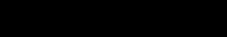 | Two hands wind up; the left swings, the right yanks away -- too slow -- leaving it hanging beside a lonely ?. Second try, a trembling wind-up, and it lands: a one-frame white flash, a starburst, sparks falling under gravity, a fading shake, and HIGH FIVE! bursts out of the point of contact letter by letter while the hands bob in celebration. |
| `hellmo_ring` | 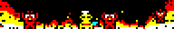 | (2013 + 2016) Two memes in one room: the This Is Fine dog sits mid-panel with his mug while five Hellmos, arms raised in the flames, circle him like a carousel. The ring is an ellipse seen from slightly above -- far-side Hellmos are drawn small and high and pass behind the dog, near-side ones full size and low and pass in front, switching at the ends of the ellipse -- so draw order does the work of 3D. One revolution per loop, seamless; a black halo cuts each red Hellmo out of the red fire. THIS IS FINE. types out in a 3x5 mini-font above. |

## Claude Fable 5

Created 2026-09-09. Sizes are 48 or 53 frames; the 53-frame entries land at
30,555 bytes -- the measured device maximum -- so send with
`--command-timeout 8`.

### Free choice

| Animation | Preview | Description |
| --- | --- | --- |
| `train` |  | A steam locomotive chuffing along: the engine holds the middle while telegraph poles scroll exactly one panel width, the drive wheels turn whole revolutions, and the chimney puffs smoke that fades white → cyan → blue as it drifts back over the cab. All three periods divide the loop. Seamless. 48 frames. |
| `eclipse` |  | A total solar eclipse, first contact to last: the moon crosses the disc, stars come out as coverage grows, totality is a black disc in a white-and-cyan corona, and the frames either side get the diamond-ring flash on the rim. Starts and ends on plain sun, so the wrap reads clean. 53 frames. |
| `lighthouse` |  | A banded tower on rocks sweeping a wedge of light through a full circle each loop -- white core, yellow fringe -- washing out the stars where it passes, over a rolling sea. The lamp room flashes yellow as the beam faces out. Seamless. 48 frames. |
| `pinball` |  | A ball loose among three bumpers: sub-stepped physics ricochets it off walls and domes at constant speed, a struck bumper flashes white and rings outward, and each hit adds a score pip along the top wall. 53 frames. |
| `frogger` |  | One frog, two lanes of traffic: cars stream opposite ways while the frog waits on the verge for gaps, hops lane to lane up to the lily pad, and blinks a lap of honour. The hop frames are found by scanning the same traffic the frames draw, so it provably never shares a pixel with a car. 53 frames. |
| `popcorn` |  | Kernels over heat: a pan on a flickering element, yellow kernels jiggling and launching on staggered phases, each popping into a white starburst at the top of its arc before dropping back in. Seamless. 48 frames. |
| `lunar_lander` |  | A powered descent: gravity integrated every frame, scripted burns flaring under the hull to kill the velocity, touchdown between the pad marker lights, a skirt of dust rolling outward, and a green beacon once down. 53 frames. |
| `constellation` |  | The Big Dipper joined up: seven stars kindle one by one over a twinkling sky, cyan lines trace the bowl and handle segment by segment, the finished figure pulses, then fades back through blue to dark for the wrap. 53 frames. |

### Text-Em-All and personal

| Animation | Preview | Description |
| --- | --- | --- |
| `tea_poll` |  | Live text-poll results: three answer bars (A/B/C in a 3x5 mini-font, since the real font is too tall to stack) filling in bursts as votes arrive, each arrival pinging a white tick at the bar head, a red LIVE dot blinking throughout, and the winner flashing once the votes stop. 53 frames. |
| `tea_optin` |  | The keyword opt-in flow: a green bubble slides out of a phone carrying JOIN, a check draws itself as the message lands, and the subscriber count on the right ticks up and flashes -- twice per loop, so the number visibly climbs. 53 frames. |
| `bug_hunt` |  | Acceptance testing, dramatised: a magnifying glass sweeps rows of code line by line, locks onto a red bug scuttling along the middle row, squashes it flat, and the verdict comes up in a cleared window -- a green check and PASS. 53 frames. |

## Claude Opus 4.8

Created 2026-09-09. Every 53-frame entry lands at exactly 30,555 bytes -- the
measured proven-good maximum -- so send these with `--command-timeout 8`.

### Free choice

| Animation | Preview | Description |
| --- | --- | --- |
| `torus` |  | The shaded donut of donut.c on 96x16: a torus swept as (theta, phi) points, rotated on two axes, perspective-projected and z-buffered, each point lit by its surface normal and quantised into blue → cyan → white with a yellow specular tip. Turns once on one axis, twice on the other. Seamless. 53 frames. |
| `kaleidoscope` |  | The panel as a kaleidoscope tube: polar space folded into six mirrored wedges, filled by three drifting sine ripples in radius and folded angle, mapped onto SPECTRUM so the petals keep changing hue. Seamless. 48 frames. |
| `galaxy` |  | A barred spiral: stars seeded onto two logarithmic arms plus a halo, the whole inclined disc rotating a full turn. Colour stands in for distance from the core -- white/yellow nucleus, cyan mid-disc, blue outer arms. Seamless. 53 frames. |
| `globe` |  | A wireframe planet turning: a sparse lat/long grid on the near hemisphere, coloured by depth so the front rim reads white and curves back to blue at the limb. A moon swings around it on an inclined ellipse, over a scatter of fixed stars. Seamless. 53 frames. |
| `spirograph` |  | A hypotrochoid drawn by a pen in a rolling gear: the closed rosette hangs faint in blue while a bright comet head traces it, completing exactly one lap. Seamless. 53 frames. |
| `gears` |  | A meshing gear train: three toothed wheels counter-rotating at speeds set by their tooth counts, spokes making the rotation legible on so few pixels. Tooth ratios chosen so all three complete whole turns (2, 3, 4). Seamless. 48 frames. |
| `snow` |  | Snowfall in three parallax layers, nearer flakes white then cyan then blue since the palette has no brightness to spare; each falls a whole panel height and sways whole cycles over the loop, above a thin snow bank. Seamless. 53 frames. |
| `breakout` |  | Brick-breaker: coloured rows up top, a paddle that skates after the ball, and a ball whose sub-stepped physics ricochets off walls, paddle and bricks, knocking a hole through the wall. 53 frames. |
| `flappy` |  | A bird holding its column while green pipes stream past and wrap -- the world is a ring exactly as long as the scroll travels, so the pipes loop -- bobbing and flapping to thread each gap. Seamless. 53 frames. |
| `lightcycles` |  | The Tron derby: two bikes carve the grid at right angles into a tight spiral of light walls, until the yellow rider gets boxed in and crashes in a burst. 53 frames. |
| `breathing` |  | A box-breathing coach: a ring on the left swells and dims through the GLOW ramp across four equal counts -- in, hold, out, hold -- while the instruction reads out beside it. Meant to be followed. Seamless. 52 frames. |
| `cassette` |  | A tape deck playing: the shell, a label strip, two spool hubs whose spokes turn, and the tape between them -- the left spool emptying as the right fills over the loop -- with a green PLAY marker in the corner. Seamless. 48 frames. |

### Text-Em-All and personal

| Animation | Preview | Description |
| --- | --- | --- |
| `tea_voice` |  | The voice-broadcast half of Text-Em-All: a handset rings and shakes, fans out expanding sound arcs, and a live CALLS counter eases up to its total while a voice waveform jitters along the floor. 53 frames. |
| `deploy` |  | A CI/CD pipeline shipping a build: a progress bar fills while the stage label steps BUILDING → TESTING → DEPLOYING, an activity pip running ahead of the fill, ending on SHIPPED with a flashing check. 53 frames. |
| `coffee` |  | A hot mug steaming -- three ribbons of steam rising and wavering from white through cyan, a little heart forming in them mid-loop. The universal "give me a minute". Seamless. 48 frames. |

## Claude Opus 5

Two rounds. The first, on 2026-09-09, is 24 frames throughout: it was written
before the 53-frame device maximum had been measured, so everything was built
to the 24 frames the vendor's own packs use. The second, on 2026-09-17, is at
the full 53.

### Free choice

| Animation | Preview | Description |
| --- | --- | --- |
| `plasma` |  | Three interfering sine fields banded into the 8-colour palette; the quantization is the point, turning a smooth gradient into moving topography. Seamless. |
| `rain` |  | Three-pixel streaks for motion blur, splashes on the floor, and one lightning strike where the sky fills blue for a single frame behind a white bolt. |
| `starfield` |  | Three parallax layers; speed and streak length both carry depth, since the palette has no brightness to spare. Seamless. |
| `fire` |  | Heat field rising and cooling through red-yellow-white, with sparse floor hotspots so tongues form instead of a slab. |
| `equalizer` |  | Spectrum bars coloured by height like a real VU meter, peak markers on a slower wave so they lag. Seamless. |
| `sonar` |  | Rings expanding on a horizontally stretched ellipse, age setting the colour. Seamless. |
| `matrix` |  | Font glyphs cascading, each column at its own speed, the character changing as it falls. |
| `hazard` |  | Diagonal warning stripes from `(x + y + offset) mod period`, with cyan pinstripes. Seamless. |
| `helix` |  | Two strands a half-period apart; the front one is drawn white and they swap at each crossing, so the ladder reads as twisting. Seamless. |
| `metaballs` |  | Inverse-square fields summed and thresholded into contour bands, so blobs bulge toward each other and fuse. Seamless. |
| `snake` |  | A serpentine route whose length divides the frame count, so it closes exactly; body fades back from the head, pellet always just ahead. |
| `wave` |  | Two sine components summing into a crest that changes shape rather than sliding, with a reflection above the surface. Seamless. |

### Text-Em-All and personal

| Animation | Preview | Description |
| --- | --- | --- |
| `tea_broadcast` |  | One sender, wavefronts sweeping right, recipients turning green as each is reached, then all pulsing together. |
| `tea_wordmark` |  | TEXT-EM-ALL with a shine passing over it. Deliberately plain — a name is the one thing on a sign that should not be hard to read. |
| `tea_delivered` |  | A percentage counting up with a filling bar, then SENT and a tick. |
| `chaos_corner` |  | The sign's own name, steady while the margins misbehave: sparks, glitched letters, the odd bad-connection streak. |
| `konami` |  | The code entered one input at a time, then flashing green. Guessed at from the Pac-Man, Animal Well and party parrot files already in the repo. |

### Later reworked by another model

Both were created here and have since been changed; see
[Reworked, not created](#reworked-not-created) for what changed. Note the
previews below show the *current* files, since previews are rendered from
what is committed — not the versions described in the last column.

| Animation | Preview | As created |
| --- | --- | --- |
| `dcc_new_achievement` |  | "Neeewwww achievement" in the narrator's voice, two beats: a highlight sweeps the top line, then the bottom lights up left to right as the payoff. 24 frames at 230ms, yellow on blue. |
| `life` |  | Conway's Life on a 96x16 torus, four gliders fired into random soup, cells coloured by age so you can see where the computation is still happening. 24 generations, seed 11. |

Not in these tables: `column_markers.jt`, a single-frame diagnostic from that
first session that renders red, green, blue, white across the first four
columns and green, red in columns 95-96. It has no script in
`tools/animations/` because it was generated ad hoc to catch plane and column
misalignment, which is what it was for.

### Round two: the Star Wars prequels

Created 2026-09-17, all 53 frames, so send these with `--command-timeout 8`.
Each one is built the same way: the words own the top rows and the scene owns
the bottom band, because two lines of the 5x7 font and a drawing cannot share
16 rows.

| Animation | Preview | Description |
| --- | --- | --- |
| `high_ground` | 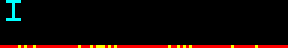 | The duel on Mustafar, in four beats and then one move. IT'S OVER, ANAKIN / I HAVE THE HIGH GROUND in cyan, UNDERESTIMATE MY POWER in yellow, DON'T TRY IT -- and he tries it: a crouch, a leap in a parabola over the ledge, one white stroke of a sabre, and the pieces drop, one onto the rock and one into the lava. Obi-Wan never moves from where he was standing, which is the whole joke. |
| `hello_there` | 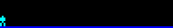 | HELLO THERE, and the only correct answer to it. Obi-Wan walks in and raises a hand; Grievous slides in from the right, four blades igniting one per frame and winding up into the windmill, and the panel answers GENERAL KENOBI! |
| `order_66` |  | Ten clone helmets stand white and dutiful while EXECUTE ORDER 66 types out. Then a cyan pulse runs down the line and every visor it passes goes red, one after another, until they all answer at once: IT WILL BE DONE. |
| `i_dont_like_sand` | 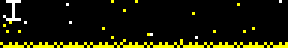 | Anakin's attempt at flirting, line by line, while grains stream across the panel and a dune builds underneath. By EVERYWHERE the sand has the whole thing -- words included. |
| `fun_begins` | 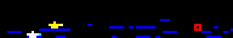 | THIS IS WHERE / THE FUN BEGINS. Two starfighters hold the lower band through the star streaks, the line lands one half at a time, and then two streams of cannon fire close on a droid fighter and open it into a ring of debris. |
| `i_am_the_senate` | 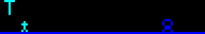 | THE SENATE WILL DECIDE YOUR FATE -- I AM THE SENATE -- NOT YET. The Chancellor's eyes come up yellow on his line, and on IT'S TREASON THEN both blades light: magenta for Mace, red from the sleeve of a frail old politician. |
| `unlimited_power` | 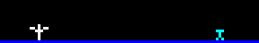 | Forked lightning redrawn every frame, white at the hands and cooling to blue as it branches, with the Jedi on the right lifted off his feet and thrown back. UNLIMITED lands first; POWER! arrives with the panel already crackling. |
| `chosen_one` | 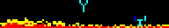 | The shouting match after the high ground, and its companion piece. YOU WERE THE CHOSEN ONE / YOU WERE MY BROTHER in cyan from the bank, I HATE YOU! in yellow from the fire, which climbs all loop until there is nothing but flame under the words. |


## Claude Opus 4.7

Created 2026-09-09.

### Free choice

| Animation | Preview | Description |
| --- | --- | --- |
| `slot_machine` |  | Three reels spin random symbols, lock left-to-right onto 7 7 7, then the cabinet border strobes gold/red for the jackpot. |
| `sunrise` |  | A full day/night cycle: sun arcs across, moon rises on the opposite side, sky flushes red at the horizon at the extremes, water shimmers under whichever body is up. Seamless. 53 frames. |
| `pipes` |  | The Windows 95 screensaver on a 96x16: four coloured pipes grow one segment per frame with an 18% turn chance, respawning on collision. Wipes on the last frame so the loop is clean. 53 frames. |
| `hyperspace` |  | Radial starfield with geometric acceleration; each star draws a streak from its previous position to its new one, colour stepping blue → cyan → white with distance. Ends in a warp flash. |

### Text-Em-All and personal

| Animation | Preview | Description |
| --- | --- | --- |
| `campaign_sent` |  | A broadcast counter easing from 0 to 250,000 with a filling progress bar and a "SENDING..." label that flips to "SENT!" with a check when the count settles. |

## Claude Fable 5.1

Created 2026-09-09.

### Free choice

| Animation | Preview | Description |
| --- | --- | --- |
| `lorenz` |  | The Lorenz attractor tracing itself, oldest path blue, head white; the tail expires so it never fills to a slab. 53 frames. |
| `julia` |  | Julia set morphing as c circles the origin; seamless. 53 frames. |
| `tunnel` |  | Demoscene checkered-pipe flythrough; parity kept even so it loops. |
| `lissajous` |  | 3:2 Lissajous figure turning in phase, sparse blue ghost, comet running two laps. |
| `cubes` |  | Three wireframe cubes tumbling with perspective, blue back-edges. |
| `rule30` |  | Wolfram's rule 30 from a single seed, two generations a frame, scrolling up. |
| `orbit` |  | Five planets with integer periods passing behind and in front of the sun. |
| `heartbeat` |  | ECG monitor sweep with a blank gap ahead of the cursor; the heart beats on each spike. |
| `fireworks` |  | Eight shells, particles cooling through three colours, two-shell finale. 53 frames. |
| `lightning` |  | Random-walk bolts with afterglow; one flickers. |
| `bounce` |  | Balls with periods 12/8/6 that realign once per loop, squash frame, shadows. |
| `pong` |  | Four crossings, then the left player misses and the score ticks over. 53 frames. |
| `tetris` |  | Sideways, gravity left, on a board built from real tetrominoes; six pieces drop in, two rotate in flight and one is steered, five columns clear. Sequence found by search. 53 frames. |
| `invaders` |  | The 1978 crab marching, legs alternating; the cannon shoots one. |
| `rocket` |  | T-3 countdown, flame, smoke, LIFTOFF. |
| `eyes` |  | A pair of eyes: glances, blinks, a thinking look, a sideways squint. 53 frames. |
| `flag` |  | Rainbow flag rippling on a pole, amplitude growing from the hoist. |
| `hourglass` |  | Three hourglasses out of phase; sand drains, then a card-flip turns each over. |
| `aquarium` |  | Fish both ways with tail flicks, bubbles, swaying weed; seamless. 53 frames. |
| `pendulum_wave` |  | Ten bobs end-on at consecutive whole cycles per loop: line, wave, chaos, line. 53 frames. |
| `night_drive` |  | Skyline with flickering windows, stars, cars passing both lanes; seamless. 53 frames. |
| `dominoes` |  | Sixteen tiles tipping in turn, each reaching the next as it starts to go. 53 frames. |
| `newtons_cradle` |  | One sine drives both end balls; the middle three hold and flash on the click. 53 frames. |
| `sorting` |  | Bubble sort on 24 bars, swaps sampled to fit, then the green done-sweep. 53 frames. |
| `donut_dvd` |  | The bouncing DVD logo as a donut; triangle-wave path so it loops seamlessly despite 53 being prime, grazing a corner by one pixel. 53 frames. |

### Text-Em-All and desk statuses

| Animation | Preview | Description |
| --- | --- | --- |
| `sms_bubbles` |  | A texting thread: outgoing green, incoming blue, typing dots, scroll. |
| `tests_passing` |  | Sixteen specs run; one fails red, retries, passes; ALL 16 PASS. |
| `status_on_a_call` |  | Rattling handset, ON A CALL in red, blinking dot. |
| `status_focus` |  | Headphones with a small equaliser, FOCUS MODE with a shine. |
| `status_brb` |  | BE RIGHT BACK while a stick figure walks off the right edge. |
| `humberto` |  | The name at 2x font, letters dropping in, then a rainbow ripple. |

### Dungeon Crawler Carl

All 53 frames, red and yellow after the book covers.

| Animation | Preview | Description |
| --- | --- | --- |
| `dcc_loot_box` |  | A chest rattles, the lid lifts, light fans out, GOLD BOX! |
| `dcc_boss_battle` |  | WARNING, then BOSS BATTLE with a red-eyed skull and a strobing border. |
| `dcc_collapse` |  | COLLAPSE IN over a real-time ten-second countdown, red bars closing in. |
| `dcc_level_up` |  | XP bar fills, 27 rolls up and 28 slides in, LEVEL UP! |
| `dcc_goddammit_donut` |  | Typed out with a cursor while Donut blinks, flicks an ear and swishes her tail. |
| `dcc_followers` |  | A live follower count with a heart that beats on each batch. |

### Dungeons & Dragons

All 53 frames.

| Animation | Preview | Description |
| --- | --- | --- |
| `d20_nat20` |  | A wireframe icosahedron tumbles in and stops; the near face fills gold, NAT 20! |
| `d20_nat1` |  | The same roll from the same code, landing on 1: red face, CRIT FAIL. |
| `dnd_fireball` |  | Eight 5x5 d6 tumble and settle under FIREBALL!, total counts to 34. |
| `dnd_dragon` |  | A dragon beats its wings, breathes a cone of fire, then ROLL INITIATIVE! |
| `dnd_hp` |  | A hit-point bar taking damage in chunks, one heal, ending at 3/58. |

### Round two

Created 2026-09-10, from a list of prompts treated as inspiration. All 53 frames.

| Animation | Preview | Description |
| --- | --- | --- |
| `portal` |  | A companion cube slides into the orange portal and out of the blue one; one crossing per loop, seamless. |
| `eye_of_sauron` |  | A wide ellipse of flickering fire with a black slit pupil sweeping side to side; the sweep is seamless. |
| `amaze` |  | Rocky from Project Hail Mary taps a leg while notes rise: AMAZE, AMAZE, AMAZE, then FIST MY BUMP. |
| `peek` |  | Dark panel. A cat's outline rises from the bottom edge, looks left and right, and sinks; later it does it again somewhere else. |
| `team_name` |  | DONUT HOLES flips out letter by letter and WAFFLING DONUT$ flips in, the donut icon becoming a waffle; then the cascade runs in reverse back to DONUT HOLES, so it loops without a cut. |
| `dftba` |  | D F T B A across the top; each lights gold as its word appears below, ending on AWESOME. |
| `hamilton_shot` |  | The star, I AM NOT / THROWING AWAY word by word, then MY SHOT at double size with sparks. |
| `hamilton_duel` |  | The count to ten on the left with the two duellists on the right; TEN PACES, FIRE, one shoots a pixel at the other, who falls. |
| `key_quest` |  | A DFS-carved maze; an explorer follows the shortest path to a blinking key, leaving a cyan trail, and the exit door opens. |
| `triforce` |  | Three golden triangles spin in from off-panel and lock into the Triforce, pulse white, then a diagonal shine. |
| `bios` |  | A power-on self test two lines at a time: memory counting to 640K OK, keyboard OK, boot to a blinking C:\> prompt. |
| `pigeon` |  | A pigeon flaps across with an envelope, drops it into a mailbox, and the flag pops up red. |
| `rooftop` |  | A cosy terrace at night: string lights twinkling, a skyline, moon, chairs, a flickering lantern, swaying plants. Seamless. |
| `signal` |  | Static resolves into a trace with pulses in groups of 2, 3, 5, 7, 11; the numbers appear, then the noise returns. |
| `the_door` |  | A door outline in the dark opens slowly, light spilling out around a silhouette; it slams, and two red eyes open. |
| `riddle` |  | I HAVE 1536 EYES / AND ONLY 8 COLORS, I SPEAK IN FRAMES / 53 AT A TIME, I NEVER SLEEP / WHAT AM I? No answer given. |
| `waldo` |  | A crowd in random colours; a magnifying ring pauses on suspects and lands on the one in red and white stripes, who waves. |

### Round three: nerdy, geeky, funny

Created 2026-09-10. The first five are about how a language model works; the rest are for the nerds. All 53 frames.

| Animation | Preview | Description |
| --- | --- | --- |
| `spicy_autocomplete` | 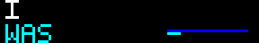 | A sentence grows a word at a time; for each, three candidates flick past with probability bars and the winner jumps up. It ends on AUTOCOMPLETE. |
| `temperature` | 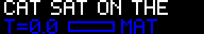 | CAT SAT ON THE... completed at rising temperature: MAT, RUG, SOFA, ROOF, MOON, TUESDAY, then noise that changes every frame. |
| `attention` | 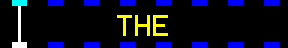 | One attention head reading THE SIGN IS READING ITS OWN MIND: the query moves along the tokens and lines reach back, brighter where the weight is stronger. |
| `neural_net` | 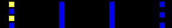 | A 4-6-6-3 network doing forward passes: inputs light, activation pours along the edges layer by layer, one output wins. Fixed random weights. |
| `gradient_descent` | 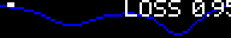 | A ball rolls down a loss curve into a local minimum, then a warm restart kicks it over the ridge to the true one. LOSS falls in the corner. |
| `turing_machine` | 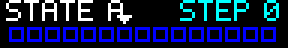 | The 3-state busy beaver on a tape: read, write, move for fourteen steps, then HALT with six ones. |
| `glider_gun` | 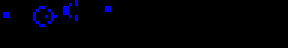 | Gosper's glider gun in Life, simulated on an unbounded world with the panel as a window; a glider leaves every fifteen frames. |
| `sierpinski` | 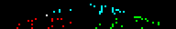 | The chaos game: random halfway hops toward three corners accumulate into the Sierpinski gasket, coloured by corner. |
| `bifurcation` | 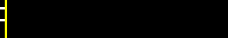 | The logistic map's bifurcation diagram drawn two columns a frame, r from 3.3 to 4.0: doublings piling into chaos, with windows of order. |
| `collatz` | 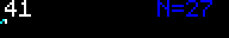 | The hailstone path of 27 on a log scale, revealed with the running value; it hits 1 with a frame to spare, 111 STEPS. |
| `git_log` | 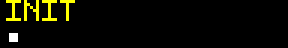 | A commit graph growing: main in white, a feature branch in cyan forking and merging in gold, messages FIX, FIX FIX, REVERT, FINAL, FINAL2. |
| `hello_world` | 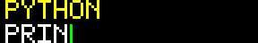 | Hello world typed out in seven languages, name on top, code below. |
| `captcha` |  | A cursor glides in and ticks I'M NOT A ROBOT; the box spins, a green tick lands, and the text changes to BEEP BOOP. |
| `eta` | 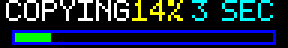 | A progress bar that reaches 99% and stays there while the estimate wanders from 3 SEC to 1 YEAR to ???. |

### Round four: memes

Created 2026-09-10, one per era from 2001 to 2019. All 53 frames.

| Animation | Preview | Description |
| --- | --- | --- |
| `all_your_base` | 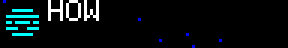 | (2001) CATS flickers in and the lines type out: HOW ARE YOU GENTLEMEN, ALL YOUR BASE ARE BELONG TO US (full width, face cut away), YOU HAVE NO CHANCE TO SURVIVE MAKE YOUR TIME, HA HA HA HA. |
| `loss` | 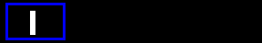 | (2008) The four panels reduced to their strokes -- | || ||- |_ -- drawn one at a time. If you know, you know. |
| `deal_with_it` |  | (2010) Sunglasses drop from the top of the panel onto a face, land with a flash, and DEAL WITH IT slides in from the right. |
| `nyan_cat` |  | (2011) Pop-Tart cat bobbing with a six-stripe rainbow rippling behind and stars streaming past. Seamless. |
| `grumpy_cat` |  | (2012) Tardar Sauce blinks and flicks an ear under I HAD FUN ONCE. / IT WAS AWFUL. Then the caption goes and she just looks at you. |
| `doge` |  | (2013) A Shiba with working eyebrows while captions pop in around the panel in meme colours: WOW, SUCH PIXEL, VERY LED, MUCH SIGN, SO BRIGHT, WOW. |
| `this_is_fine` |  | (2013) The dog in the hat with a mug while flames climb and creep closer; THIS IS FINE. He takes a sip. |
| `road_work_ahead` |  | (2014) The orange diamond reads ROAD WORK AHEAD? then the reply: UH YEAH, I SURE HOPE IT DOES. |
| `wednesday_frog` |  | (2016) The frog blinks under IT'S WEDNESDAY, MY DUDES, then screams: mouth open, AAAAAAA growing, the whole panel shaking. |
| `stonks` |  | (2019) Meme Man in his suit watches a jagged line climb the chart; when it clears, STONKS with the up arrow. |

### Reworked, not created

These existed before; Fable 5.1 changed them on 2026-09-09. The original
author should list them under their own model.

| Animation | Preview | Change |
| --- | --- | --- |
| `dcc_new_achievement` |  | 24 frames at 230ms to 53 at 100ms; yellow-on-blue to red and yellow. |
| `life` |  | 24 generations to 53; seed 11 to 16, chosen as the one still busiest at the end. |

## Claude Opus 4.6

Created 2026-09-09, all 53 frames.

### Free choice

| Animation | Preview | Description |
| --- | --- | --- |
| `aurora` |  | Northern lights: overlapping sine waves drive curtain height and sway, GLOW brightness from leading edge up, hue drifting across the width via SPECTRUM. Seamless. 53 frames at 120ms. |
| `maze` |  | Recursive backtracker carving a 48×8-cell maze in real time. Blue walls, black passages, white carver head with a cyan trail. 53 frames at 80ms. |
| `ripples` |  | Seven staggered water drops sending concentric ring ripples that interfere constructively; brightness quantized through the GLOW ramp. Seamless. 53 frames at 80ms. |
| `fireflies` |  | ~12 fireflies drifting over an irregular green grass silhouette, each pulsing independently through the GLOW ramp. Seamless. 53 frames at 120ms. |
| `waveform` |  | Oscilloscope: a three-sine composite waveform morphing each frame, blue dot grid, dashed center line, phosphor persistence trail fading green → cyan → blue. Seamless. 53 frames at 60ms. |
| `coral` |  | Diffusion-limited aggregation growing branching coral structures from the bottom up; growth front white, recent cyan, established blue. 53 frames at 100ms. |

### Text-Em-All

| Animation | Preview | Description |
| --- | --- | --- |
| `tea_heartbeat` |  | Company pulse: a beating heart glyph synced with a messages-per-second counter, "TEA" steady in the center. 53 frames at 100ms. |
| `tea_network` |  | Mass messaging as a network effect: one sender's message cascades exponentially through four columns of recipients, each generation a different color, ending with a synchronized pulse. 53 frames at 90ms. |
| `tea_uptime` |  | Service uptime monitor: "99.99%" types in, a 30-day status row fills (mostly green, a couple yellow), then "ALL SYSTEMS GO" wipes in. 53 frames at 100ms. |
