# AI-created animations

Which of the animations in `src/sample/` were made by an AI model, by which
model, and when. Each has a matching script in `tools/animations/` that
regenerates it. Dates are the date of the commit that added the file.

Frame counts: 24 unless noted; **53** is the measured device maximum.

The previews in `docs/gifs/` are rendered from the committed `.jt` files at
3x, with the real frame delays. Regenerate one after changing its script:

```sh
python3 tools/preview_jt.py src/sample/NAME.jt --gif docs/gifs/NAME.gif --scale 3
```

## Claude Sonnet 5.5

Created 2026-09-30 for a request for 10-15 memes plus 5-10 animations of
free choice, worth putting on a wall. Frame counts run 40 to 53; `rickroll`,
`woman_yelling_cat`, `clippy` and `cat_laser` are 53 frames
(30,528 bytes), just under the measured device maximum, so send those with
`--command-timeout 8`. Each was drafted by a helper agent and reviewed
against rendered frames of the written file; none has been tried on hardware.

### Memes, 1998 to 2019

| Animation | Preview | Description |
| --- | --- | --- |
| `rickroll` | 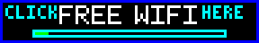 | (2007) A blue-bordered "FREE WIFI" dialog fills its progress bar while a cursor arrives to click it. The panel glitches into an ERROR flicker, then a quiffed, trench-coated dancer strikes four alternating poses on the left while NEVER / GONNA / GIVE / YOU / UP lands one word per beat, with the full lyric scrolling below in magenta. A second glitch drops back to the loading bar for the loop. |
| `keyboard_cat` | 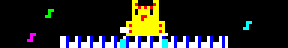 | (2007) A cat sits behind a white keyboard and bounces his paws in alternation, each struck key lighting cyan while coloured music notes drift up both sides. PLAY HIM OFF then flashes red and yellow as a cane hooks from the right and drags him, flipped upside down, off the left edge, leaving the empty keyboard before the loop. |
| `hampster_dance` | 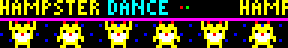 | (1998) Six yellow hamsters with white muzzles sway in a row over a drifting blue-dot tiled background, alternating between a paws-up pose and a dropped, arms-out pose so neighbours always move in opposition. A black marquee bar with a pulsing magenta and blue rule scrolls HAMPSTER DANCE in yellow and cyan, looping seamlessly. |
| `surprised_pikachu` | 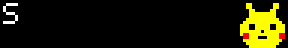 | (2018) STUDY FOR EXAM? types out on two lines and NAH blinks in yellow while a content yellow mouse face with red cheeks and dark-tipped ears watches from the right. Then the text flips to red FAILED THE EXAM, the eyes swell, the ears jolt and the mouth stretches into a wide O with a red tongue. |
| `mocking_text` | 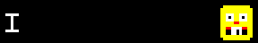 | (2017) I LOVE MONDAYS types out in plain white, then every second letter flips upside down and turns yellow, one letter per frame, since the font has no lowercase to alternate. The flipped letters then bob against the plain ones while a square yellow sponge-style face with buck teeth rocks from side to side in a slouch. |
| `two_buttons` | 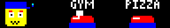 | (2016) A worried yellow head in a blue cap sweats on the left, with cyan drops flying off him, while a shaky white hand hovers back and forth between two red buttons labelled GYM and PIZZA. His pupils follow the hand. Then two hands slam both buttons at once, the domes flash magenta, and his mouth opens wide. |
| `roll_safe` | 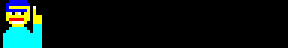 | (2017) A grinning, half-lidded man on the left taps his temple with one finger on an 8-frame beat, the fist darting away and back with a bob of the head. On the right a left-to-right wipe reveals YOU CAN'T BE BROKE, then adds IF YOU DON'T, then slides up to IF YOU DON'T / CHECK YOUR ACCOUNT, which blinks white at the end. |
| `kermit_tea` | 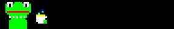 | (2014) A green frog with goggling white eyes and a red mouth lifts a cup of tea for a slow sip, with cyan steam wisps curling off it. His pupils slide sideways as BUT THAT'S NONE / OF MY BUSINESS wipes in on the right, and he sips a second time before the loop. |
| `woman_yelling_cat` | 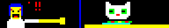 | (2019) Two panels split by a blue line. On the left a woman with her arm thrust out yells and shakes, with red anger marks and "!!" flickering. On the right a white green-eyed cat sits behind a plate of vegetables and stares back, blinking slowly. They alternate twice, then the table tilts and the plate and greens fly up while the cat stays put. |

### Free choice

| Animation | Preview | Description |
| --- | --- | --- |
| `ufo_abduction` | 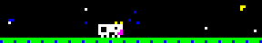 | A saucer glides in over a starry night field, switches on a cyan-and-blue tractor beam and lifts a white cow with black patches, which turns from side to front to side to back as sparkles drift up the beam. The cow slips into the saucer, which gives a yellow BURP with a green puff, then zips off right trailing a dashed cyan-to-blue streak. A fresh cow is standing there when the loop restarts. |
| `cat_laser` | 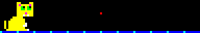 | A ginger cat with green eyes sits at the left edge, its head and pupils following a red laser dot that hops around the panel on quick, jittery seeded paths (with a magenta blur between hops) while its tail twitches. The dot parks on the floor, the cat crouches and wiggles, pounces across the panel and lands on nothing, with a "?" over its head. It backs home and looks around innocently while the dot reappears far away. |
| `rubber_duck` | 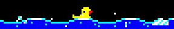 | A yellow rubber duck bobs on cyan and blue waves, tilting with each swell that passes under it, while bubbles rise through the water and pop into little white sparks above the surface. The duck blinks and gives a SQUEAK, and a small foam pile on the right grows as the bubbles multiply into a bubble bath. The wave and bubble phases wrap, so the loop is seamless. |
| `sushi_conveyor` | 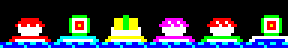 | A kaiten belt scrolls plates of tuna, salmon and shrimp nigiri, a fat maki roll and a tamago slice left along a ticking cyan-and-blue belt, each on a different coloured rim. A pair of yellow and white chopsticks drops in, pinches the tuna off one plate and whisks it away upward, leaving the empty rice to sail off the left edge. The belt moves exactly one pattern width per loop, so it repeats seamlessly. |
| `clippy` | 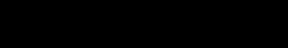 | A bent cyan paperclip with googly eyes and yellow eyebrows bounces in from the left and a yellow speech box opens beside him, typing out IT LOOKS LIKE YOU'RE WRITING A LETTER... in 3x5 text. Two options (WRITE THE LETTER in red, JUST TYPE, THANKS in blue) appear below, the user picks the second, and the box shuts. Clippy winks and shrinks to nothing before the loop restarts. |
| `hypno_spiral` | 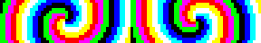 | Two mirrored spirals, one centred in each half of the panel, turn in opposite directions. Each is computed per pixel from angle and radius, and the eight-colour palette flows through the arms while a slow pulse squeezes the arm spacing. The palette laps exactly once per loop, so there is no seam. |
| `campfire` | 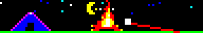 | Red flames with a yellow mid and a white-hot core dance over crossed logs, their heights a sum of seeded sine waves that wrap perfectly. Sparks rise and drift, stars twinkle, and a yellow crescent moon hangs over a blue-and-magenta tent. On the right a marshmallow on a stick slowly turns from white to gold as it roasts. |
| `stadium_wave` | 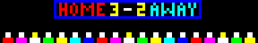 | A row of 19 little fans in mismatched shirts rises in a wave that rolls left to right across the panel. Each fan goes from slumped to standing with both arms up, and a beach ball rides the crest while one fan waves a red foam finger. A HOME 3-2 AWAY scoreboard sits up top, and the ball passes behind it. The wave enters and leaves the panel completely, so the loop is seamless. |

### Round two: ten more, free choice

Created 2026-10-09 for a request for ten animations of free choice. Six are
53 frames (30,528 bytes), `windmill`, `metronome` and `rain_window` are 52 and
`vinyl_record` is 48, so send the large ones with `--command-timeout 8`. Each
file was verified by round-trip and previewed from the written `.jt`; none has
been tried on hardware.

| Animation | Preview | Description |
| --- | --- | --- |
| `mandelbrot` | 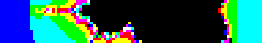 | A dive into Seahorse Valley: every pixel runs the z -> z^2 + c escape loop and takes its colour from how many steps it needed, so filaments and spirals come out as bands of the palette. The iteration cap climbs as the view tightens (about 270x deeper at the bottom) and the zoom follows a cosine in and back out, so the loop is seamless. |
| `cyclic_automaton` | 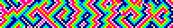 | Eight states, each hungry for the next: a cell advances as soon as one of its four neighbours is one step ahead. Seeded noise, run on the wrapping panel for 150 unseen steps, organises into interlocking spirals and travelling fronts that walk the whole palette. One automaton step per frame. |
| `elevator` | 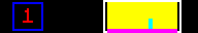 | A lift: the doors rest open on L1 with a rider inside, slide shut, and the red floor numeral counts 1 to 5 under a blinking up arrow. Then DING, the doors part on a lit yellow interior and the rider steps forward and out. |
| `windmill` | 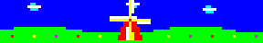 | A red tapering Dutch windmill with a white cap and four turning sails on a green hill, tulips nodding in a gust and clouds drifting across a blue sky. The sails are four-fold symmetric and the clouds travel exactly one panel width, so the loop is seamless. |
| `metronome` | 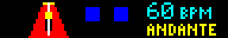 | A red pyramid ticking at 60 BPM: a white rod swings either side of vertical with a yellow weight riding it, and the TICK and TOCK lamps light green at the extremes beside a 60 BPM / ANDANTE legend. One loop is a full there-and-back. |
| `rain_window` | 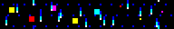 | Night bus, wet glass: out-of-focus city lights pulse as 3x3 blobs behind a misted pane while 18 droplets slide down it, white heads with cyan-then-blue trails. Each drop travels a whole number of panel heights per loop, so the loop is seamless. |
| `vinyl_record` | 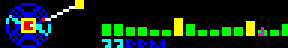 | A black record with blue grooves and a red-and-yellow label spins at 33 RPM, two cyan sheens sweeping round it and a white marker proving the direction. The tonearm rides the groove with a tiny wobble, and green-yellow-red equaliser bars bounce beside it. |
| `seasons_tree` | 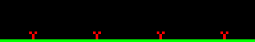 | Four fractal trees (binary recursion, 0.72x per fork) grow bough by bough, burst into magenta blossom and shed petals, turn summer green, then autumn yellow and red with leaves falling, and stand bare under white snow. Each sways on its own phase of the breeze. |
| `magic_8_ball` | 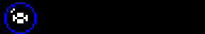 | WILL IT / LOOP? types out in yellow beside a black 8-ball with the 8 in its window. The ball shakes on jittered offsets as question marks fly, then settles with a cyan triangle and SIGNS POINT / TO YES fades up, blinking green and yellow. |
| `cuckoo_clock` | 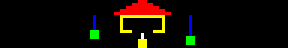 | A red-roofed chalet clock with a yellow case, a swinging pendulum and chain weights. Three times the little door opens and a cyan bird lunges out beak first while CUCK and OO flash on opposite sides, alternating each strike. |

## Claude Opus 5.5

Created 2026-09-23, all 53 frames at 30,555 bytes -- the measured device
maximum -- so send these with `--command-timeout 8`.

### Free choice

| Animation | Preview | Description |
| --- | --- | --- |
| `chess_mate` | 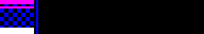 | Scholar's mate on a real 8x8 board at 2px a square, which is exactly the panel's 16 rows. Each piece lifts off a green-highlighted square and slides into place while the move list (1.E4 E5 ... 3.QH5 NF6?? 4.QXF7#) writes itself on the right and scrolls up; then the black king's square blinks red under a flashing CHECKMATE. |
| `traffic_wave` | 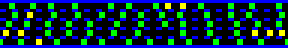 | Five ring-road lanes, each running a seeded Nagel–Schreckenberg traffic model, cars coloured by speed: green cruising, yellow slowing, red stopped. One driver brakes (flashing white), and the red knot that follows drifts backwards against the traffic even though every car in it keeps moving forward. |
| `langtons_ant` | 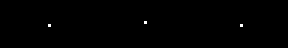 | Three Langton's ants in yellow, cyan and magenta on the wrapping 96x16 panel, starting at 3 steps a frame so their first scribbles can be followed, then speeding up as the patches grow and collide. Any ant treats any painted cell as painted, so they repaint and erase each other's trails. |
| `waggle_dance` | 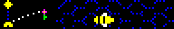 | A striped forager on a dotted honeycomb dances one full figure eight in exactly 53 frames: a buzzing, shaking straight run 70° from vertical, then a loop back, alternating right and left. On the left a hive, the sun and a flower 70° round show what the dance means; the dotted line to the flower marches while she waggles. |
| `mitosis` | 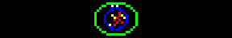 | A cell divides: chromatin condenses into four X-shaped chromosomes, the envelope breaks into dots, centrosomes move apart, spindle fibres line the chromosomes up, then each X splits into chevrons pulled to the poles and two daughter nuclei form. The membrane is a two-point metaball field, so it pinches into a peanut and splits by itself, with no furrow drawn. |
| `washing_machine` |  | A front-loader: a red sock, blue shirt, yellow towel and magenta pants tumble through cyan water with rising bubbles, the drum reversing halfway. Then SPIN: each item becomes an arc along the drum wall whose length grows with speed -- motion blur in 3 bits -- the cabinet walks side to side, and the readout climbs to 1400 RPM before it slows and refills. |
| `bit_order` | 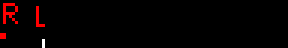 | The sign's own storage order, made visible. A landscape is painted exactly as the `.jt` stores it: a scan head walks each column top to bottom, about 93 bits a frame, first the red plane alone, then green over it (reds turn yellow), then blue to complete all 8 colours. An R/G/B label tracks the plane, and the finished picture holds under a tick. |
| `double_slit` | 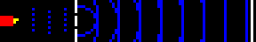 | A red emitter fires single photons at a barrier with two slits; faint wavefronts spread beyond, and each photon lands as a flash on the detector at a row drawn from a seeded cos² × sinc² two-slit distribution. Hits stack into a histogram growing leftward from the screen, and as the rate ramps up, bright fringes with dark rows between emerge from the noise. |
| `seismograph` | 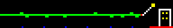 | A drum recorder: paper scrolls left under a pivoting pen, a quiet line gives way to fast P-waves, then S-waves swinging nearly the full 16 rows and a decay, while a little building sways (roof further than base) and a readout climbs to M6.8. The paper pattern repeats every loop with the quake only in the part frame 0 never shows, so the record scrolls off and the loop is seamless. |
| `timelapse_garden` | 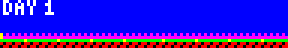 | Five days in a flower bed: the sun arcs over a blue sky with a magenta band at dawn and dusk, a crescent moon crosses a starfield, and plants grow only while it is light -- seed, sprout, leaves, bud, bloom, eight colours of flower -- with a DAY counter in a 3x5 mini-font. Ends in full bloom on the last night. |

### Memes, 2015 to 2024

| Animation | Preview | Description |
| --- | --- | --- |
| `the_dress` | 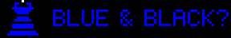 | (2015) A striped dress flips between BLUE & BLACK? and WHITE & GOLD?, each reading held a little shorter than the last until it flickers every frame; then a magenta seam splits it into both readings at once, both captions stacked. |
| `drake` | 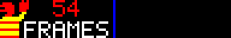 | (2015) Drakeposting laid side by side: an orange-jacketed figure turns away with a raised palm from 54 FRAMES, which gets struck through, then grins and points at 53 FRAMES with a green tick. A sign in-joke -- 53 is the hardware maximum, and 54 transfers "successfully" but is silently ignored. |
| `distracted_boyfriend` | 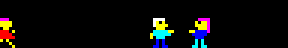 | (2017) A woman in red walks in and the boyfriend's head whips round to follow while his body stays turned to his girlfriend, whose face flushes under a scowl and an anger mark. Then the labels land -- LED SIGN, ME, MY JOB -- in a hand-built 3x5 mini-font so ten rows are left for the figures. |
| `galaxy_brain` | 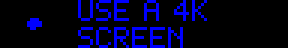 | (2017) Four stages, each brain bigger and brighter: USE A 4K SCREEN, USE AN LED SIGN, ONLY 96X16 PIXELS, 8 COLORS IS PLENTY. The glow climbs the palette's only ramp, BLUE → CYAN → WHITE, and the last brain blazes with shock-waves of light rolling out across the panel. |
| `bongo_cat` | 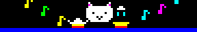 | (2018) The round white cat slaps the bongos left, right, left, right; each hit flashes the rim, throws impact marks and sends a coloured note drifting up. A pause with paws raised, then both at once with happy ^ ^ eyes. Notes are simulated modulo the loop, so it has no seam. |
| `thanos_snap` | 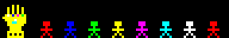 | (2018) The gauntlet's stones glint in turn, fingers snap, the panel whites out and a shockwave crosses eight little heroes -- then four come apart pixel by pixel, each on its own seeded schedule, drifting up and right as ash cooling yellow → red → magenta → blue. PERFECTLY, then BALANCED. |
| `crab_rave` | 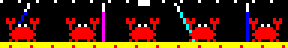 | (2018) Five red crabs dance on a 4-frame beat -- about 125 BPM -- claws pumping and sidestepping in sync under disco beams that go solid on the downbeat. The middle three burrow into the sand, BUGS IS GONE appears framed by the two that stay, and the three dig back up for the loop. |
| `among_us` | 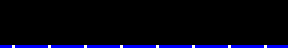 | (2020) A red crewmate (bean body, cyan visor with a glint, backpack) walks in and SUS lands beside it at double size. Cut to space: the ejected body tumbles a quarter turn every two frames across a three-speed parallax starfield, then RED WAS NOT / THE IMPOSTOR. types out over the stars. |
| `wordle` | 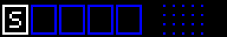 | (2022) The current guess in five big tiles on the left, the share grid building on the right. Each tile squashes, changes colour and springs back in turn; STORM, CRANE, NAVEL, PANEL are coloured by a real Wordle scoring function, duplicate-letter rules included. The winning row hops in a wave, then SPLENDID. |
| `moo_deng` | 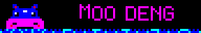 | (2024) The baby pygmy hippo face-on in her pool -- wet-shine head, wide pink muzzle, blushing cheeks -- bouncing with a splash at each landing while MOO DENG ripples. She rears up and chomps three times (CHOMP!), then a big hop sprays water for BOUNCY PIG. |

### Joy

Created 2026-09-23 for a request for something that makes people want to run
through a wall -- the feeling `wednesday_frog` got when it went up on a
Wednesday. Not all share its build-up-then-shake shape; the brief was the
delight, not the structure.

| Animation | Preview | Description |
| --- | --- | --- |
| `oh_yeah` | 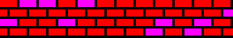 | A brick wall trembles in rumbles while cracks spread white-hot from one point. A white flash, the grinning red pitcher bursts through, and each brick holds until the shockwave from the impact reaches it, then flies off as its own particle. OH YEAH! slams in at double size, strobing, the whole panel shaking. |
| `over_9000` | 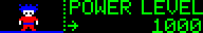 | (2006) A spiky-haired fighter powers up as the scouter climbs from POWER LEVEL 1000, his aura going BLUE → CYAN → WHITE → YELLOW with rocks floating up; the hair turns gold as the reading hits exactly 9001. The scouter pops in a white flash and IT'S OVER, then 9000!!!, scream in at double size. The aura keeps a one-pixel black gap round him so he reads whatever its colour. |
| `leeroy_jenkins` | 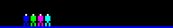 | (2005) Four adventurers huddle while the plan types out -- 32.3333... running off the panel, (REPEATING) -- then a gold paladin wanders in late: OK LET'S / DO THIS. He charges across the panel in seven frames trailing dust, ! marks pop over the party, the name stretches out a letter a frame to LEEEEROY, and JENKINS!!! slams in shaking. |
| `this_is_sparta` | 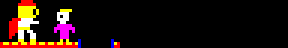 | (2007) A red-crested Spartan faces a messenger at the edge of a pit: MADNESS?, then THIS, then IS. A white flash, the kick, and the messenger hangs over the pit for a cartoon beat beside a "!" before he drops -- then SPARTA!!! fills the panel at double size, strobing red, yellow and white, the Spartan bobbing in triumph. |
| `hype_meter` | 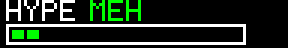 | A segmented HYPE gauge climbs through MEH, OK, HYPED and UNHINGED, green to yellow to red, rattling harder as it rises until segments burst out past the end of the box. A white flash, a spark blast, then LET'S drops in at double size and bounces, and GOOOO!!! follows an O at a time under a rain of sparks. |
| `zoomies` | 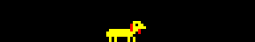 | A yellow dog wagging in the middle of the panel gets a "!" and bolts: edge to edge and back, faster every lap (7 up to 23 px a frame), skidding at each wall in a spray of dust, trailing blue and cyan motion-blur copies while ZOOMIES! strobes overhead. Then it flops on its belly, tongue out, tail going, and hearts float up. |
| `letters_dance` | 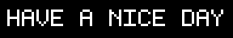 | HAVE A NICE DAY in plain white, the most boring sign in the building -- until the C twitches, the Y glances over its shoulder, and they all break loose: a travelling wave, then a rainbow conga line that snakes off one edge and back in the other, each letter pirouetting. They scramble home and freeze, perfectly still, except the A, which landed upside down. No shake; the surprise is the joke. |
| `high_five` |  | Two hands wind up; the left swings, the right yanks away -- too slow -- leaving it hanging beside a lonely ?. Second try, a trembling wind-up, and it lands: a one-frame white flash, a starburst, sparks falling under gravity, a fading shake, and HIGH FIVE! bursts out of the point of contact letter by letter while the hands bob in celebration. |
| `hellmo_ring` | 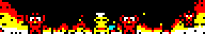 | (2013 + 2016) Two memes in one room: the This Is Fine dog sits mid-panel in profile, as in the comic -- bowler hat, long snout, floppy ear, mug held out -- while five Hellmos, arms raised in the flames, circle him like a carousel. The ring is an ellipse seen from slightly above -- far-side Hellmos are drawn small and high and pass behind the dog, near-side ones full size and low and pass in front, with a middle size at the ends of the ellipse and feet that glide a row at a time with depth, so each grows over several frames instead of popping -- and draw order does the work of 3D. One revolution per loop, seamless; a black halo cuts each red Hellmo out of the red fire. THIS IS FINE. types out in a 3x5 mini-font above. |

### Satisfying

Created 2026-09-26 for a request for animations that are visually pleasing or
satisfying to watch: things clicking into place, sorting, filling, weaving.

| Animation | Preview | Description |
| --- | --- | --- |
| `ball_sort` | 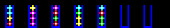 | The tube puzzle: five colours, four balls each, dealt at random into five of seven tubes. A breadth-first search finds the shortest solve -- 13 moves -- and each move lifts the top ball clear, carries it over and drops it in. A finished tube lights up in its colour; when all five are done the rack flashes white. |
| `bubble_wrap` | 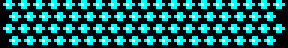 | A sheet of cyan bubbles with white glints, popped by a front that wanders left to right with seeded jitter, so a few run ahead and a few hold out. Each pop is a one-frame yellow burst, then a crinkled blue scrap; the sheet reinflates from the left to start again. |
| `flip_disc` | 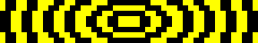 | A 48x8 flip-dot board of yellow discs, each 2x2 pixels, flipping through rings, checks, hearts and diagonals. Every flip shows one frame edge-on as a blue sliver, and each change travels differently: a sweep, a ripple from the centre, a diagonal, a random scatter. Seamless. |
| `loom` | 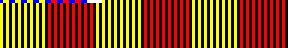 | A white shuttle races back and forth weaving one row per pass: yellow and red warp stripes, blue then magenta weft, and wherever the pattern lifts the warp over the weft its colour shows, so nested diamonds grow out of bare threads. The finished cloth rolls off the top. |
| `sand_art` | 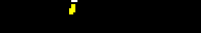 | A falling-sand automaton: a spout visits seven spots, pouring a new colour at each, and every pour heaps into a mound that avalanches down over the ones before -- layered sand in a bottle. The stream wiggles as the spout drifts. |
| `stack_tower` | 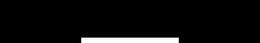 | The stacking game: rainbow slabs slide in from alternate sides and stop over the tower. Overhangs are sliced off and tumble away under gravity; dead-on drops flash white. The view scrolls as the tower climbs. |
| `tusi_couple` | 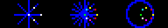 | Dots that only move in straight lines, drawing a circle: each slides along its own line through the centre, phase-shifted by the line's angle, and together they roll round as a circle half the size. Four lines, then eight, then the same eight with the lines hidden, where it just looks like a wheel. Seamless. |
| `zipper` | 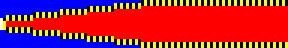 | A white slider eases along the panel meshing interlocking yellow teeth; ahead of it the blue tapes splay into a V over a red lining. It closes, pauses and eases back open, so the loop is seamless. |

### Simulations and demos

Created 2026-09-26 for a request for "really cool animations". Most are a
real algorithm running rather than a drawing -- a raycaster, boids, a
reaction-diffusion system, an agent-based slime mold, RK4 chaos -- picked
because nothing in the collection did them yet. All 53 frames at 30,528
bytes.

| Animation | Preview | Description |
| --- | --- | --- |
| `raycaster` | 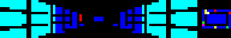 | A Wolfenstein-style first-person walk round a ring corridor: every view column casts a DDA ray into a 12x8 map, walls shade WHITE-CYAN-BLUE with distance and one step darker on east-west faces, mortar lines slide past, and floor-grid dots mark the ground. Each leg ends at a coloured banner, the camera turns on the spot at every corner, and a minimap on the right tracks a blinking player dot. Seamless. |
| `murmuration` | 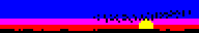 | Sixty starlings as black specks against a sunset -- blue sky, a magenta band, a red horizon, a yellow sun sinking into a treeline -- flocking on Reynolds' three boid rules alone. Halfway through, a hawk (a larger black chevron) cuts across and the flock tears open around it and seals behind. |
| `turing_patterns` | 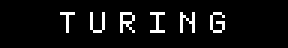 | The word TURING seeds a Gray-Scott reaction-diffusion system on the wrapping panel. The letters swell into blobs, bud and split, and worms branch out until a fingerprint labyrinth fills the panel -- the patterns Turing predicted in 1952. Activator concentration drawn through BLUE, CYAN and WHITE; the simulation speeds up as it goes. |
| `asteroids` | 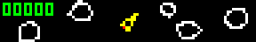 | The 1979 vector game with an autopilot that never misses: a yellow outline ship at the centre turns to the nearest rock, leads its drift, and fires. White polygon rocks split big to medium to small, small ones burst into red and yellow sparks, everything wraps at the edges, and a green score ticks up in the corner. |
| `copper_bars` | 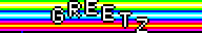 | An Amiga demoscene intro: three shaded raster bars (blue-cyan-white, magenta-red-yellow, green-yellow-white) orbit an invisible cylinder, passing in front of and behind each other, over a three-speed starfield, while GREETZ rides a travelling sine letter by letter in white with a black keyline. Seamless. |
| `slime_mold` | 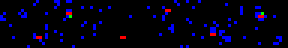 | Physarum as 260 agents that sniff, turn toward the strongest trail and deposit more. Scattered blue noise knits into a mesh of veins within a few frames, the veins touching the six red oat flakes thicken to yellow and white, and dead ends fade as the network consolidates. |
| `stained_glass` | 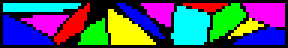 | A Voronoi window: fourteen seeds drift on Lissajous paths, each pixel takes its nearest seed's colour and near-ties become black lead came, so panes swell, pinch off and trade territory while the leading redraws itself. A diagonal glint of sunlight sweeps across once a loop. Seamless. |
| `double_pendulum` | 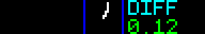 | Three double pendulums on one pivot, red, green and blue, released 0.001 rad apart. They overlap as one white pendulum (the channels add to white), then colour fringes appear and each flails on its own. A strip chart on the left shows the three lower-arm traces forking; on the right their spread in degrees climbs from green through yellow to red. |

### The sign has a life

Created 2026-09-26 from a brainstorm with the user, who picked these for
fun: a sign that stares back, hides ghosts and fights its own frame, plus
two puzzles for passers-by and a Marauder's Map. Each was drafted by a
helper agent and reviewed against rendered frames of the written file.

| Animation | Preview | Description |
| --- | --- | --- |
| `marauders_map` |  | I SOLEMNLY SWEAR / I AM UP TO NO GOOD writes itself, then yellow ink spreads from the centre into a Hogwarts floor plan. Named footprint trails walk the corridor, older prints fading: HARRY (red) creeps in, SNAPE (green) sweeps the other way, Harry ducks through a doorway just in time and Snape's banner blinks SNAPE? before he stalks off; RON (magenta) joins Harry. The ink drains away and MISCHIEF MANAGED writes itself. |
| `tamagotchi` | 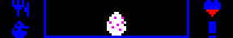 | The toy's LCD in a blue bezel with icon bays that light when used, and a heart meter that fills. A spotted egg wobbles and hatches a cyan blob that bounces, turns sad as the "!" flashes, eats a burger in three chomps, leaves a pile with green stink lines, gets it washed away by a duck riding a wave, and ends in floating red hearts. |
| `staring_contest` | 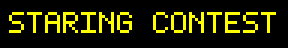 | STARING CONTEST, GO!, then a huge pair of eyes stares out of the panel. They widen, a lid twitches, red veins creep in, tears well along the bottom lids and a lid quivers lower -- until they squeeze shut into > < with tears squirting. Payoff: small bloodshot eyes looking at the floor beside YOU WIN. and BEST OF 3? |
| `ghost_in_the_machine` | 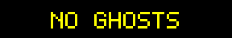 | A sober NO GHOSTS sign glitches, and a little pixel ghost floats in, grabs the N and O and drags them off, so the sign reads just GHOSTS while it giggles HEE HEE. A red "!" -- it rushes the letters back, fades out, and the sign is normal again, except the O went back one pixel too high. |
| `tiny_village` | 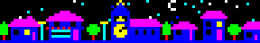 | A day in a miniature village across the whole panel: cottages, a bakery with an awning, a church whose clock hand turns through the day. Night, dawn, noon and dusk; the baker opens up and waves, the noon bell scares a bird off the steeple, a woman walks her dog to the bakery and home with a loaf, a car drives through, and windows and street lamps light one by one after dark. Seamless. |
| `stick_fight` | 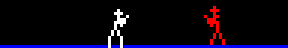 | A Xiao Xiao-style brawl between white and red stick figures on joint-angle skeletons: a blocked punch, a jab, a side kick with yellow sparks, then a flying kick that sends red cartwheeling out of the panel. White celebrates, then tries to leave: bonks face-first into the right edge (it flashes like glass), headbutts the ceiling, sprints left with speed lines into the other edge, and sits slumped under a little rain cloud. |
| `word_ladder` | 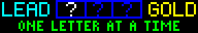 | An alchemist's word ladder: big cyan LEAD and yellow GOLD wait either side of three rungs of thinking question marks under ONE LETTER AT A TIME, for about four seconds. Then the ladder fills rung by rung -- HEAD, HELD, HOLD, GOLD -- each changed letter scrambling in magenta and landing in green, before a sweep turns the whole ladder gold. |
| `spot_the_difference` | 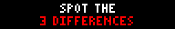 | SPOT THE / 3 DIFFERENCES, then two copies of a cottage scene (sun, cat, fence, apple tree) either side of a timer bar draining green to red. When time runs out, the three differences -- a lit window, a missing chimney, an extra bird -- are bracketed in flashing magenta on both halves as the divider counts 1, 2, 3. |

### Ten more, free choice

Created 2026-10-09 for a request for ten animations of free choice. All are
53 frames at 30,555 bytes except `piano` (52, one Fur Elise phrase), so send
them with `--command-timeout 8`. Each file was verified by round-trip and
reviewed as frames rendered from the written `.jt`; none has been tried on
hardware.

| Animation | Preview | Description |
| --- | --- | --- |
| `sandpile` | 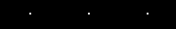 | The abelian sandpile: grains poured on three spots, any cell with four or more toppling one to each neighbour and grains lost off the edge. The stable piles grow nested diamond patterns coloured by height -- black, blue, magenta, yellow -- until they press against the top and bottom edges. |
| `galton_board` | 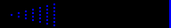 | A bean machine on its side: 128 yellow balls bounce up or down at each of seven peg columns and run along one of eight rows to stack against the right wall, so the cyan stacks grow into a binomial bell curve. Red markers then blink at the expected heights. |
| `hilbert_curve` | 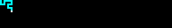 | Six order-3 Hilbert curves, one per 16x16 tile at a 2px pitch, chained into one 384-point path that a white head draws across the panel. Then rainbow bands stream along the finished curve. |
| `fourier` | 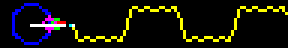 | Four epicycles for the first odd harmonics of a square wave spin on the left, each riding the last; the tip's height feeds a yellow trace scrolling right, where four sines add up to a square wave with Gibbs ripples at the corners. One turn per loop, seamless. |
| `a_star` | 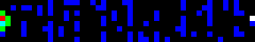 | A* on a 48x8 grid of blue walls, from a cyan start to a white goal: the green frontier advances and red cells close one expansion at a time, then the shortest path traces back in yellow and blinks. |
| `sieve` | 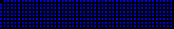 | The Sieve of Eratosthenes on 1 to 384, eight rows of 48 dots. Each prime up to 19 blinks and sweeps out its multiples in its own colour; with 48 to a row, multiples of 2 and 3 fall in columns and 5 and 7 in diagonals. Then the struck numbers clear and only the white primes are left. |
| `bowling` | 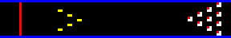 | A strike from above: a magenta ball rolls past the aiming arrows and hooks into the pocket, each pin starting to tumble when the shock reaches it and sliding off into the gutters and pit. A cyan sweep bar clears the deck and STRIKE! flashes with sparkles. |
| `crosswalk` | 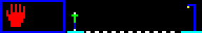 | A pedestrian signal beside a side view of the street: steady red hand while a walker taps a foot at the kerb, the white walking figure while they stroll across, then a flashing hand counting down 9 to 0 as a latecomer in yellow sprints over. On the steady hand a red car rushes through. |
| `piano` | 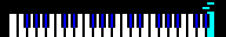 | The opening of Fur Elise, Synthesia style: notes fall as bars onto a keyboard of 22 white keys, right hand cyan and left hand green, and each key lights while held. The phrase ends on D#5 and the piece returns to E5, so the loop is seamless. |
| `rube_goldberg` | 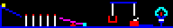 | A machine for switching on a light: a marble rolls down a ramp into five dominoes, the last lands on a seesaw that flicks a ball into a hanging bucket, the bucket's weight hauls a rope over two pulleys to throw a switch, and a spark runs down the wire to light the bulb. |

### Gags

Made 2026-10-09 for a request for ten animations that would make the user
laugh. Each is 53 frames (30,528 bytes), so send with `--command-timeout 8`.
Each is built as setup, a held beat and a payoff, and none loops seamlessly:
each ends on its final joke and cuts back to the start. They were drafted by
helper agents and checked by rendering frames of the written files. None has
been tried on hardware.

| Animation | Preview | Description |
| --- | --- | --- |
| `cat_knock` | 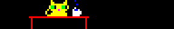 | A yellow cat on a red table beside a steaming white mug. It glances at the mug, turns to stare straight at you with wide green eyes, and, holding eye contact, pushes the mug to the edge a pixel at a time. A held beat on the brink, one more nudge, and it smashes: CRASH!, shards and a blue puddle. The cat licks its paw, blinks slowly, OOPS. 53 frames at 120ms. |
| `banana_slip` | 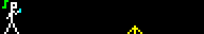 | A stick figure strides in staring at a cyan phone, whistling green and magenta notes, toward a yellow banana peel. Foot meets peel: the phone flies, the body hangs flat in midair for a six-frame beat, then slams down with OOF! and stars circling. The peel spins up and lands draped over their face; one leg twitches. 53 frames at 110ms. |
| `fake_sneeze` | 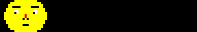 | A big yellow face builds to a sneeze -- AH... AHH... AHHHH... -- head tipping back, nostrils flaring, eyes squeezed into > <, quivering on the brink. Then it fades: ...NEVERMIND. Three quiet frames. Then a white flash and a giant red CHOO!! as the head snaps forward and spray covers all 96 columns, drips sliding down the glass. Button: a blush and a magenta ...EXCUSE ME. 53 frames at 130ms. |
| `toaster` | 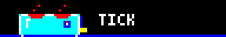 | A chrome toaster ticks (TICK / TOCK) with glowing red slots. DING! Both slices rocket off the top of the panel. A long wait as ". . ." fills in, a red !, then the toast whistles back down charred and on fire, lands exactly in the slots with a squash and a smoke puff: NAILED IT. 53 frames at 120ms. |
| `reply_all` |  | BOB: LUNCH? A cursor hesitates over REPLY ALL, clicks -- TO: ALL / 4812! -- and the unread badge doubles 2, 4, 16, 128, 512, 999+ while RE: RE: RE: stacks off the edge and envelopes pile up. The panel shakes as REMOVE ME!!, STOP REPLYING ALL, UNSUBSCRIBE, +1 and WHO IS BOB?? flash. A white-out, silence, then one last email: FROM: BOB, RE: RE: RE: THANKS! -- and a green +1. 53 frames at 120ms. |
| `dad_joke` | 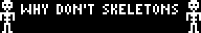 | Two skeletons flank the setup, WHY DON'T SKELETONS / FIGHT EACH OTHER?, held long enough to read. Three dots tick in, then THEY DON'T HAVE / THE GUTS. A little drum kit plays BA, DUM, a wind-up, TSS! with the cymbal flashing and rocking. A green cricket chirps into the silence; GROAN. 53 frames at 150ms. |
| `goose_chase` | 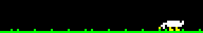 | A man in a red hat strolls along the lawn eating a sandwich (CHOMP). A white goose looks up -- ?, then a red ! held as eye contact -- and HONK! He freezes, then sprints off screaming AAA! as it chases him out flapping, snatching his hat. The empty park, a distant AAAAAAA. The goose struts back wearing the hat with the sandwich in its beak and gives one smug HONK. 53 frames at 120ms. |
| `snail_race` | 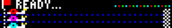 | A sports broadcast: three snails on a three-lane track, the finish line far off at the right. READY... GO! AND THEY'RE OFF! The crowd jumps, cameras flash, nobody moves. WHAT A START! NECK AND NECK. DAY 1... DAY 47 as sun and moon trade places. The magenta snail edges one pixel: HE'S MAKING HIS MOVE! A REPLAY at 1/10 SPEED with a telestrator ring: +1PX. Ends on LAP 1 OF 500. 53 frames at 150ms. |
| `roomba_stuck` | 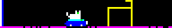 | A robot vacuum with a loafing cat on top drives into a chair leg: BONK. Backs up, turns a few degrees, BONK, faster each time, its light going green, yellow, red, #@%!, its clean stripe barely longer than itself. A sulky ... beat, then it spins and races away -- FREE! -- straight into the wall. BONK! The cat is tossed, hops off, says MEH. and naps under the chair. 53 frames at 130ms. |
| `chicken_road` | 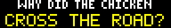 | WHY DID THE CHICKEN / CROSS THE ROAD? A chicken leaves its egg on the verge and dashes across two lanes of traffic, each car missing by a pixel, feathers flying. YAY! Then ?... WAIT. MY EGG! It runs back and a yellow taxi hits it: HONK!, feathers everywhere, a plucked magenta chicken under spinning stars. Button: the egg hatches and a chick strolls across the jammed road. PEEP! 53 frames at 140ms. |

## Claude Fable 5

Created 2026-09-09. Sizes are 48 or 53 frames; the 53-frame entries land at
30,555 bytes -- the measured device maximum -- so send with
`--command-timeout 8`.

### Free choice

| Animation | Preview | Description |
| --- | --- | --- |
| `train` | 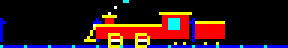 | A steam locomotive chuffing along: the engine holds the middle while telegraph poles scroll exactly one panel width, the drive wheels turn whole revolutions, and the chimney puffs smoke that fades white → cyan → blue as it drifts back over the cab. All three periods divide the loop. Seamless. 48 frames. |
| `eclipse` | 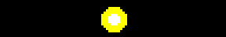 | A total solar eclipse, first contact to last: the moon crosses the disc, stars come out as coverage grows, totality is a black disc in a white-and-cyan corona, and the frames either side get the diamond-ring flash on the rim. Starts and ends on plain sun, so the wrap reads clean. 53 frames. |
| `lighthouse` | 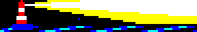 | A banded tower on rocks sweeping a wedge of light through a full circle each loop -- white core, yellow fringe -- washing out the stars where it passes, over a rolling sea. The lamp room flashes yellow as the beam faces out. Seamless. 48 frames. |
| `pinball` | 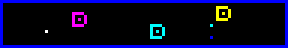 | A ball loose among three bumpers: sub-stepped physics ricochets it off walls and domes at constant speed, a struck bumper flashes white and rings outward, and each hit adds a score pip along the top wall. 53 frames. |
| `frogger` | 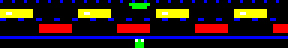 | One frog, two lanes of traffic: cars stream opposite ways while the frog waits on the verge for gaps, hops lane to lane up to the lily pad, and blinks a lap of honour. The hop frames are found by scanning the same traffic the frames draw, so it provably never shares a pixel with a car. 53 frames. |
| `popcorn` | 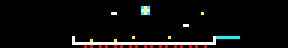 | Kernels over heat: a pan on a flickering element, yellow kernels jiggling and launching on staggered phases, each popping into a white starburst at the top of its arc before dropping back in. Seamless. 48 frames. |
| `lunar_lander` | 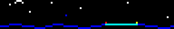 | A powered descent: gravity integrated every frame, scripted burns flaring under the hull to kill the velocity, touchdown between the pad marker lights, a skirt of dust rolling outward, and a green beacon once down. 53 frames. |
| `constellation` | 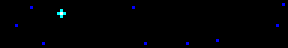 | The Big Dipper joined up: seven stars kindle one by one over a twinkling sky, cyan lines trace the bowl and handle segment by segment, the finished figure pulses, then fades back through blue to dark for the wrap. 53 frames. |

### Text-Em-All and personal

| Animation | Preview | Description |
| --- | --- | --- |
| `tea_poll` | 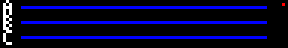 | Live text-poll results: three answer bars (A/B/C in a 3x5 mini-font, since the real font is too tall to stack) filling in bursts as votes arrive, each arrival pinging a white tick at the bar head, a red LIVE dot blinking throughout, and the winner flashing once the votes stop. 53 frames. |
| `tea_optin` | 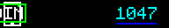 | The keyword opt-in flow: a green bubble slides out of a phone carrying JOIN, a check draws itself as the message lands, and the subscriber count on the right ticks up and flashes -- twice per loop, so the number visibly climbs. 53 frames. |
| `bug_hunt` | 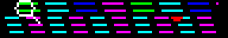 | Acceptance testing, dramatised: a magnifying glass sweeps rows of code line by line, locks onto a red bug scuttling along the middle row, squashes it flat, and the verdict comes up in a cleared window -- a green check and PASS. 53 frames. |

## Claude Opus 4.8

Created 2026-09-09. Every 53-frame entry lands at exactly 30,555 bytes -- the
measured proven-good maximum -- so send these with `--command-timeout 8`.

### Free choice

| Animation | Preview | Description |
| --- | --- | --- |
| `torus` | 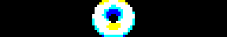 | The shaded donut of donut.c on 96x16: a torus swept as (theta, phi) points, rotated on two axes, perspective-projected and z-buffered, each point lit by its surface normal and quantised into blue → cyan → white with a yellow specular tip. Turns once on one axis, twice on the other. Seamless. 53 frames. |
| `kaleidoscope` | 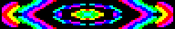 | The panel as a kaleidoscope tube: polar space folded into six mirrored wedges, filled by three drifting sine ripples in radius and folded angle, mapped onto SPECTRUM so the petals keep changing hue. Seamless. 48 frames. |
| `galaxy` | 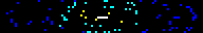 | A barred spiral: stars seeded onto two logarithmic arms plus a halo, the whole inclined disc rotating a full turn. Colour stands in for distance from the core -- white/yellow nucleus, cyan mid-disc, blue outer arms. Seamless. 53 frames. |
| `globe` | 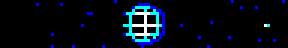 | A wireframe planet turning: a sparse lat/long grid on the near hemisphere, coloured by depth so the front rim reads white and curves back to blue at the limb. A moon swings around it on an inclined ellipse, over a scatter of fixed stars. Seamless. 53 frames. |
| `spirograph` | 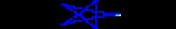 | A hypotrochoid drawn by a pen in a rolling gear: the closed rosette hangs faint in blue while a bright comet head traces it, completing exactly one lap. Seamless. 53 frames. |
| `gears` | 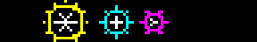 | A meshing gear train: three toothed wheels counter-rotating at speeds set by their tooth counts, spokes making the rotation legible on so few pixels. Tooth ratios chosen so all three complete whole turns (2, 3, 4). Seamless. 48 frames. |
| `snow` | 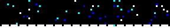 | Snowfall in three parallax layers, nearer flakes white then cyan then blue since the palette has no brightness to spare; each falls a whole panel height and sways whole cycles over the loop, above a thin snow bank. Seamless. 53 frames. |
| `breakout` | 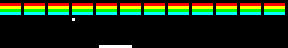 | Brick-breaker: coloured rows up top, a paddle that skates after the ball, and a ball whose sub-stepped physics ricochets off walls, paddle and bricks, knocking a hole through the wall. 53 frames. |
| `flappy` | 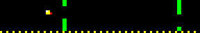 | A bird holding its column while green pipes stream past and wrap -- the world is a ring exactly as long as the scroll travels, so the pipes loop -- bobbing and flapping to thread each gap. Seamless. 53 frames. |
| `lightcycles` | 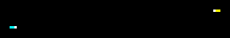 | The Tron derby: two bikes carve the grid at right angles into a tight spiral of light walls, until the yellow rider gets boxed in and crashes in a burst. 53 frames. |
| `breathing` | 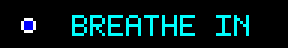 | A box-breathing coach: a ring on the left swells and dims through the GLOW ramp across four equal counts -- in, hold, out, hold -- while the instruction reads out beside it. Meant to be followed. Seamless. 52 frames. |
| `cassette` | 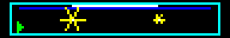 | A tape deck playing: the shell, a label strip, two spool hubs whose spokes turn, and the tape between them -- the left spool emptying as the right fills over the loop -- with a green PLAY marker in the corner. Seamless. 48 frames. |

### Text-Em-All and personal

| Animation | Preview | Description |
| --- | --- | --- |
| `tea_voice` | 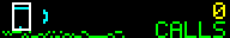 | The voice-broadcast half of Text-Em-All: a handset rings and shakes, fans out expanding sound arcs, and a live CALLS counter eases up to its total while a voice waveform jitters along the floor. 53 frames. |
| `deploy` | 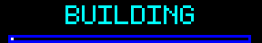 | A CI/CD pipeline shipping a build: a progress bar fills while the stage label steps BUILDING → TESTING → DEPLOYING, an activity pip running ahead of the fill, ending on SHIPPED with a flashing check. 53 frames. |
| `coffee` | 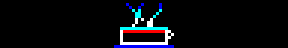 | A hot mug steaming -- three ribbons of steam rising and wavering from white through cyan, a little heart forming in them mid-loop. The universal "give me a minute". Seamless. 48 frames. |

## Claude Opus 5

Two rounds. The first, on 2026-09-09, is 24 frames throughout: it was written
before the 53-frame device maximum had been measured, so everything was built
to the 24 frames the vendor's own packs use. The second, on 2026-09-17, is at
the full 53.

### Free choice

| Animation | Preview | Description |
| --- | --- | --- |
| `plasma` | 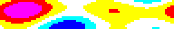 | Three interfering sine fields banded into the 8-colour palette; the quantization is the point, turning a smooth gradient into moving topography. Seamless. |
| `rain` | 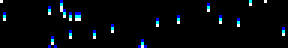 | Three-pixel streaks for motion blur, splashes on the floor, and one lightning strike where the sky fills blue for a single frame behind a white bolt. |
| `starfield` | 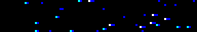 | Three parallax layers; speed and streak length both carry depth, since the palette has no brightness to spare. Seamless. |
| `fire` | 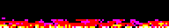 | Heat field rising and cooling through red-yellow-white, with sparse floor hotspots so tongues form instead of a slab. |
| `equalizer` | 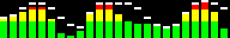 | Spectrum bars coloured by height like a real VU meter, peak markers on a slower wave so they lag. Seamless. |
| `sonar` | 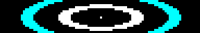 | Rings expanding on a horizontally stretched ellipse, age setting the colour. Seamless. |
| `matrix` | 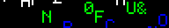 | Font glyphs cascading, each column at its own speed, the character changing as it falls. |
| `hazard` | 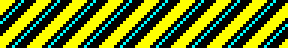 | Diagonal warning stripes from `(x + y + offset) mod period`, with cyan pinstripes. Seamless. |
| `helix` | 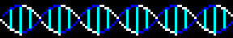 | Two strands a half-period apart; the front one is drawn white and they swap at each crossing, so the ladder reads as twisting. Seamless. |
| `metaballs` | 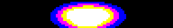 | Inverse-square fields summed and thresholded into contour bands, so blobs bulge toward each other and fuse. Seamless. |
| `snake` | 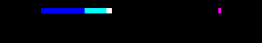 | A serpentine route whose length divides the frame count, so it closes exactly; body fades back from the head, pellet always just ahead. |
| `wave` | 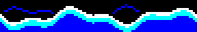 | Two sine components summing into a crest that changes shape rather than sliding, with a reflection above the surface. Seamless. |

### Text-Em-All and personal

| Animation | Preview | Description |
| --- | --- | --- |
| `tea_broadcast` | 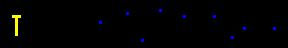 | One sender, wavefronts sweeping right, recipients turning green as each is reached, then all pulsing together. |
| `tea_wordmark` | 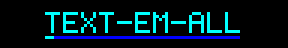 | TEXT-EM-ALL with a shine passing over it. Deliberately plain — a name is the one thing on a sign that should not be hard to read. |
| `tea_delivered` | 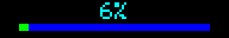 | A percentage counting up with a filling bar, then SENT and a tick. |
| `chaos_corner` | 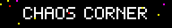 | The sign's own name, steady while the margins misbehave: sparks, glitched letters, the odd bad-connection streak. |
| `konami` | 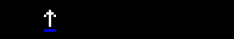 | The code entered one input at a time, then flashing green. Guessed at from the Pac-Man, Animal Well and party parrot files already in the repo. |

### Later reworked by another model

Both were created here and have since been changed; see
[Reworked, not created](#reworked-not-created) for what changed. Note the
previews below show the *current* files, since previews are rendered from
what is committed — not the versions described in the last column.

| Animation | Preview | As created |
| --- | --- | --- |
| `dcc_new_achievement` | 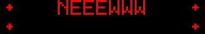 | "Neeewwww achievement" in the narrator's voice, two beats: a highlight sweeps the top line, then the bottom lights up left to right as the payoff. 24 frames at 230ms, yellow on blue. |
| `life` | 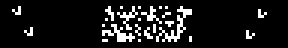 | Conway's Life on a 96x16 torus, four gliders fired into random soup, cells coloured by age so you can see where the computation is still happening. 24 generations, seed 11. |

Not in these tables: `column_markers.jt`, a single-frame diagnostic from that
first session that renders red, green, blue, white across the first four
columns and green, red in columns 95-96. It has no script in
`tools/animations/` because it was generated ad hoc to catch plane and column
misalignment, which is what it was for.

### Round two: the Star Wars prequels

Created 2026-09-17, all 53 frames, so send these with `--command-timeout 8`.
Each one is built the same way: the words own the top rows and the scene owns
the bottom band, because two lines of the 5x7 font and a drawing cannot share
16 rows.

| Animation | Preview | Description |
| --- | --- | --- |
| `high_ground` | 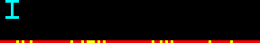 | The duel on Mustafar, in four beats and then one move. IT'S OVER, ANAKIN / I HAVE THE HIGH GROUND in cyan, UNDERESTIMATE MY POWER in yellow, DON'T TRY IT -- and he tries it: a crouch, a leap in a parabola over the ledge, one white stroke of a sabre, and the pieces drop, one onto the rock and one into the lava. Obi-Wan never moves from where he was standing, which is the whole joke. |
| `hello_there` | 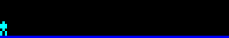 | HELLO THERE, and the only correct answer to it. Obi-Wan walks in and raises a hand; Grievous slides in from the right, four blades igniting one per frame and winding up into the windmill, and the panel answers GENERAL KENOBI! |
| `order_66` |  | Ten clone helmets stand white and dutiful while EXECUTE ORDER 66 types out. Then a cyan pulse runs down the line and every visor it passes goes red, one after another, until they all answer at once: IT WILL BE DONE. |
| `i_dont_like_sand` | 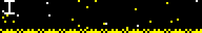 | Anakin's attempt at flirting, line by line, while grains stream across the panel and a dune builds underneath. By EVERYWHERE the sand has the whole thing -- words included. |
| `fun_begins` | 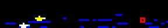 | THIS IS WHERE / THE FUN BEGINS. Two starfighters hold the lower band through the star streaks, the line lands one half at a time, and then two streams of cannon fire close on a droid fighter and open it into a ring of debris. |
| `i_am_the_senate` | 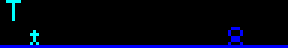 | THE SENATE WILL DECIDE YOUR FATE -- I AM THE SENATE -- NOT YET. The Chancellor's eyes come up yellow on his line, and on IT'S TREASON THEN both blades light: magenta for Mace, red from the sleeve of a frail old politician. |
| `unlimited_power` | 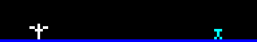 | Forked lightning redrawn every frame, white at the hands and cooling to blue as it branches, with the Jedi on the right lifted off his feet and thrown back. UNLIMITED lands first; POWER! arrives with the panel already crackling. |
| `chosen_one` | 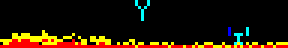 | The shouting match after the high ground, and its companion piece. YOU WERE THE CHOSEN ONE / YOU WERE MY BROTHER in cyan from the bank, I HATE YOU! in yellow from the fire, which climbs all loop until there is nothing but flame under the words. |


## Claude Opus 4.7

Created 2026-09-09.

### Free choice

| Animation | Preview | Description |
| --- | --- | --- |
| `slot_machine` | 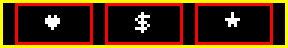 | Three reels spin random symbols, lock left-to-right onto 7 7 7, then the cabinet border strobes gold/red for the jackpot. |
| `sunrise` | 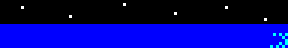 | A full day/night cycle: sun arcs across, moon rises on the opposite side, sky flushes red at the horizon at the extremes, water shimmers under whichever body is up. Seamless. 53 frames. |
| `pipes` | 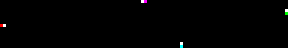 | The Windows 95 screensaver on a 96x16: four coloured pipes grow one segment per frame with an 18% turn chance, respawning on collision. Wipes on the last frame so the loop is clean. 53 frames. |
| `hyperspace` | 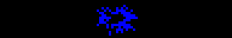 | Radial starfield with geometric acceleration; each star draws a streak from its previous position to its new one, colour stepping blue → cyan → white with distance. Ends in a warp flash. |

### Text-Em-All and personal

| Animation | Preview | Description |
| --- | --- | --- |
| `campaign_sent` | 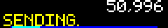 | A broadcast counter easing from 0 to 250,000 with a filling progress bar and a "SENDING..." label that flips to "SENT!" with a check when the count settles. |

## Claude Fable 5.1

Created 2026-09-09.

### Free choice

| Animation | Preview | Description |
| --- | --- | --- |
| `lorenz` | 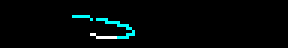 | The Lorenz attractor tracing itself, oldest path blue, head white; the tail expires so it never fills to a slab. 53 frames. |
| `julia` | 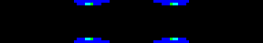 | Julia set morphing as c circles the origin; seamless. 53 frames. |
| `tunnel` |  | Demoscene checkered-pipe flythrough; parity kept even so it loops. |
| `lissajous` | 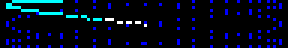 | 3:2 Lissajous figure turning in phase, sparse blue ghost, comet running two laps. |
| `cubes` | 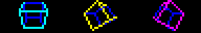 | Three wireframe cubes tumbling with perspective, blue back-edges. |
| `rule30` | 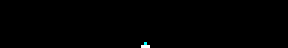 | Wolfram's rule 30 from a single seed, two generations a frame, scrolling up. |
| `orbit` | 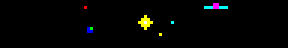 | Five planets with integer periods passing behind and in front of the sun. |
| `heartbeat` | 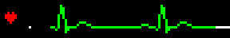 | ECG monitor sweep with a blank gap ahead of the cursor; the heart beats on each spike. |
| `fireworks` | 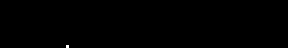 | Eight shells, particles cooling through three colours, two-shell finale. 53 frames. |
| `lightning` | 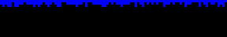 | Random-walk bolts with afterglow; one flickers. |
| `bounce` | 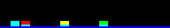 | Balls with periods 12/8/6 that realign once per loop, squash frame, shadows. |
| `pong` | 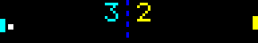 | Four crossings, then the left player misses and the score ticks over. 53 frames. |
| `tetris` | 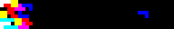 | Sideways, gravity left, on a board built from real tetrominoes; six pieces drop in, two rotate in flight and one is steered, five columns clear. Sequence found by search. 53 frames. |
| `invaders` | 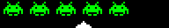 | The 1978 crab marching, legs alternating; the cannon shoots one. |
| `rocket` | 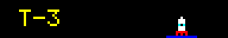 | T-3 countdown, flame, smoke, LIFTOFF. |
| `eyes` | 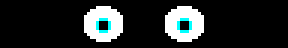 | A pair of eyes: glances, blinks, a thinking look, a sideways squint. 53 frames. |
| `flag` | 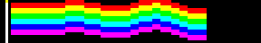 | Rainbow flag rippling on a pole, amplitude growing from the hoist. |
| `hourglass` | 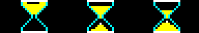 | Three hourglasses out of phase; sand drains, then a card-flip turns each over. |
| `aquarium` | 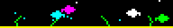 | Fish both ways with tail flicks, bubbles, swaying weed; seamless. 53 frames. |
| `pendulum_wave` | 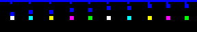 | Ten bobs end-on at consecutive whole cycles per loop: line, wave, chaos, line. 53 frames. |
| `night_drive` | 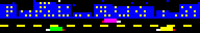 | Skyline with flickering windows, stars, cars passing both lanes; seamless. 53 frames. |
| `dominoes` | 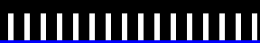 | Sixteen tiles tipping in turn, each reaching the next as it starts to go. 53 frames. |
| `newtons_cradle` | 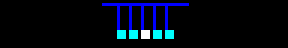 | One sine drives both end balls; the middle three hold and flash on the click. 53 frames. |
| `sorting` | 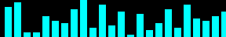 | Bubble sort on 24 bars, swaps sampled to fit, then the green done-sweep. 53 frames. |
| `donut_dvd` | 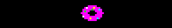 | The bouncing DVD logo as a donut; triangle-wave path so it loops seamlessly despite 53 being prime, grazing a corner by one pixel. 53 frames. |

### Text-Em-All and desk statuses

| Animation | Preview | Description |
| --- | --- | --- |
| `sms_bubbles` | 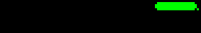 | A texting thread: outgoing green, incoming blue, typing dots, scroll. |
| `tests_passing` | 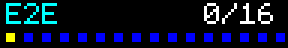 | Sixteen specs run; one fails red, retries, passes; ALL 16 PASS. |
| `status_on_a_call` | 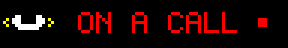 | Rattling handset, ON A CALL in red, blinking dot. |
| `status_focus` | 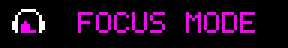 | Headphones with a small equaliser, FOCUS MODE with a shine. |
| `status_brb` | 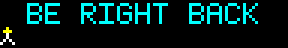 | BE RIGHT BACK while a stick figure walks off the right edge. |
| `humberto` |  | The name at 2x font, letters dropping in, then a rainbow ripple. |

### Dungeon Crawler Carl

All 53 frames, red and yellow after the book covers.

| Animation | Preview | Description |
| --- | --- | --- |
| `dcc_loot_box` | 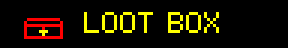 | A chest rattles, the lid lifts, light fans out, GOLD BOX! |
| `dcc_boss_battle` |  | WARNING, then BOSS BATTLE with a red-eyed skull and a strobing border. |
| `dcc_collapse` | 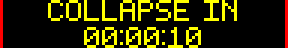 | COLLAPSE IN over a real-time ten-second countdown, red bars closing in. |
| `dcc_level_up` | 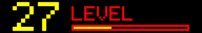 | XP bar fills, 27 rolls up and 28 slides in, LEVEL UP! |
| `dcc_goddammit_donut` | 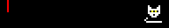 | Typed out with a cursor while Donut blinks, flicks an ear and swishes her tail. |
| `dcc_followers` | 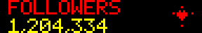 | A live follower count with a heart that beats on each batch. |

### Dungeons & Dragons

All 53 frames.

| Animation | Preview | Description |
| --- | --- | --- |
| `d20_nat20` |  | A wireframe icosahedron tumbles in and stops; the near face fills gold, NAT 20! |
| `d20_nat1` |  | The same roll from the same code, landing on 1: red face, CRIT FAIL. |
| `dnd_fireball` | 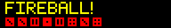 | Eight 5x5 d6 tumble and settle under FIREBALL!, total counts to 34. |
| `dnd_dragon` | 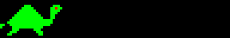 | A dragon beats its wings, breathes a cone of fire, then ROLL INITIATIVE! |
| `dnd_hp` | 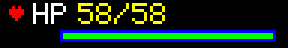 | A hit-point bar taking damage in chunks, one heal, ending at 3/58. |

### Round two

Created 2026-09-10, from a list of prompts treated as inspiration. All 53 frames.

| Animation | Preview | Description |
| --- | --- | --- |
| `portal` | 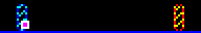 | A companion cube slides into the orange portal and out of the blue one; one crossing per loop, seamless. |
| `eye_of_sauron` | 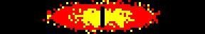 | A wide ellipse of flickering fire with a black slit pupil sweeping side to side; the sweep is seamless. |
| `amaze` | 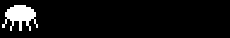 | Rocky from Project Hail Mary taps a leg while notes rise: AMAZE, AMAZE, AMAZE, then FIST MY BUMP. |
| `peek` |  | Dark panel. A cat's outline rises from the bottom edge, looks left and right, and sinks; later it does it again somewhere else. |
| `team_name` | 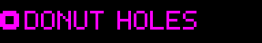 | DONUT HOLES flips out letter by letter and WAFFLING DONUT$ flips in, the donut icon becoming a waffle; then the cascade runs in reverse back to DONUT HOLES, so it loops without a cut. |
| `dftba` | 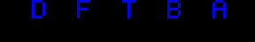 | D F T B A across the top; each lights gold as its word appears below, ending on AWESOME. |
| `hamilton_shot` |  | The star, I AM NOT / THROWING AWAY word by word, then MY SHOT at double size with sparks. |
| `hamilton_duel` |  | The count to ten on the left with the two duellists on the right; TEN PACES, FIRE, one shoots a pixel at the other, who falls. |
| `key_quest` | 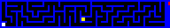 | A DFS-carved maze; an explorer follows the shortest path to a blinking key, leaving a cyan trail, and the exit door opens. |
| `triforce` |  | Three golden triangles spin in from off-panel and lock into the Triforce, pulse white, then a diagonal shine. |
| `bios` | 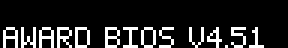 | A power-on self test two lines at a time: memory counting to 640K OK, keyboard OK, boot to a blinking C:\> prompt. |
| `pigeon` | 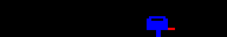 | A pigeon flaps across with an envelope, drops it into a mailbox, and the flag pops up red. |
| `rooftop` | 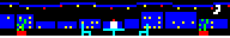 | A cosy terrace at night: string lights twinkling, a skyline, moon, chairs, a flickering lantern, swaying plants. Seamless. |
| `signal` | 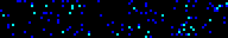 | Static resolves into a trace with pulses in groups of 2, 3, 5, 7, 11; the numbers appear, then the noise returns. |
| `the_door` |  | A door outline in the dark opens slowly, light spilling out around a silhouette; it slams, and two red eyes open. |
| `riddle` | 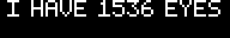 | I HAVE 1536 EYES / AND ONLY 8 COLORS, I SPEAK IN FRAMES / 53 AT A TIME, I NEVER SLEEP / WHAT AM I? No answer given. |
| `waldo` | 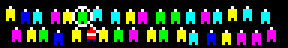 | A crowd in random colours; a magnifying ring pauses on suspects and lands on the one in red and white stripes, who waves. |

### Round three: nerdy, geeky, funny

Created 2026-09-10. The first five are about how a language model works; the rest are for the nerds. All 53 frames.

| Animation | Preview | Description |
| --- | --- | --- |
| `spicy_autocomplete` | 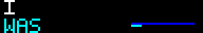 | A sentence grows a word at a time; for each, three candidates flick past with probability bars and the winner jumps up. It ends on AUTOCOMPLETE. |
| `temperature` | 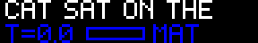 | CAT SAT ON THE... completed at rising temperature: MAT, RUG, SOFA, ROOF, MOON, TUESDAY, then noise that changes every frame. |
| `attention` | 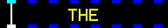 | One attention head reading THE SIGN IS READING ITS OWN MIND: the query moves along the tokens and lines reach back, brighter where the weight is stronger. |
| `neural_net` | 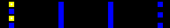 | A 4-6-6-3 network doing forward passes: inputs light, activation pours along the edges layer by layer, one output wins. Fixed random weights. |
| `gradient_descent` | 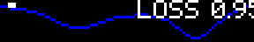 | A ball rolls down a loss curve into a local minimum, then a warm restart kicks it over the ridge to the true one. LOSS falls in the corner. |
| `turing_machine` | 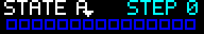 | The 3-state busy beaver on a tape: read, write, move for fourteen steps, then HALT with six ones. |
| `glider_gun` | 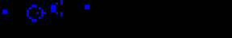 | Gosper's glider gun in Life, simulated on an unbounded world with the panel as a window; a glider leaves every fifteen frames. |
| `sierpinski` | 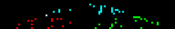 | The chaos game: random halfway hops toward three corners accumulate into the Sierpinski gasket, coloured by corner. |
| `bifurcation` | 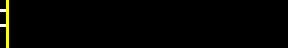 | The logistic map's bifurcation diagram drawn two columns a frame, r from 3.3 to 4.0: doublings piling into chaos, with windows of order. |
| `collatz` | 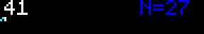 | The hailstone path of 27 on a log scale, revealed with the running value; it hits 1 with a frame to spare, 111 STEPS. |
| `git_log` | 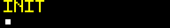 | A commit graph growing: main in white, a feature branch in cyan forking and merging in gold, messages FIX, FIX FIX, REVERT, FINAL, FINAL2. |
| `hello_world` | 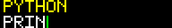 | Hello world typed out in seven languages, name on top, code below. |
| `captcha` |  | A cursor glides in and ticks I'M NOT A ROBOT; the box spins, a green tick lands, and the text changes to BEEP BOOP. |
| `eta` | 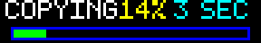 | A progress bar that reaches 99% and stays there while the estimate wanders from 3 SEC to 1 YEAR to ???. |

### Round four: memes

Created 2026-09-10, one per era from 2001 to 2019. All 53 frames.

| Animation | Preview | Description |
| --- | --- | --- |
| `all_your_base` | 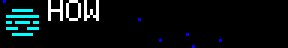 | (2001) CATS flickers in and the lines type out: HOW ARE YOU GENTLEMEN, ALL YOUR BASE ARE BELONG TO US (full width, face cut away), YOU HAVE NO CHANCE TO SURVIVE MAKE YOUR TIME, HA HA HA HA. |
| `loss` | 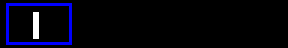 | (2008) The four panels reduced to their strokes -- | || ||- |_ -- drawn one at a time. If you know, you know. |
| `deal_with_it` |  | (2010) Sunglasses drop from the top of the panel onto a face, land with a flash, and DEAL WITH IT slides in from the right. |
| `nyan_cat` | 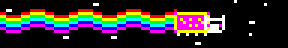 | (2011) Pop-Tart cat bobbing with a six-stripe rainbow rippling behind and stars streaming past. Seamless. |
| `grumpy_cat` | 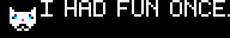 | (2012) Tardar Sauce blinks and flicks an ear under I HAD FUN ONCE. / IT WAS AWFUL. Then the caption goes and she just looks at you. |
| `doge` | 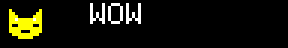 | (2013) A Shiba with working eyebrows while captions pop in around the panel in meme colours: WOW, SUCH PIXEL, VERY LED, MUCH SIGN, SO BRIGHT, WOW. |
| `this_is_fine` | 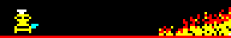 | (2013) The dog in the hat with a mug while flames climb and creep closer; THIS IS FINE. He takes a sip. |
| `road_work_ahead` | 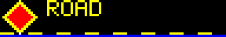 | (2014) The orange diamond reads ROAD WORK AHEAD? then the reply: UH YEAH, I SURE HOPE IT DOES. |
| `wednesday_frog` | 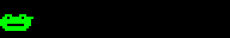 | (2016) The frog blinks under IT'S WEDNESDAY, MY DUDES, then screams: mouth open, AAAAAAA growing, the whole panel shaking. |
| `stonks` | 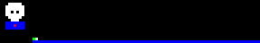 | (2019) Meme Man in his suit watches a jagged line climb the chart; when it clears, STONKS with the up arrow. |

### Reworked, not created

These existed before; Fable 5.1 changed them on 2026-09-09. The original
author should list them under their own model.

| Animation | Preview | Change |
| --- | --- | --- |
| `dcc_new_achievement` |  | 24 frames at 230ms to 53 at 100ms; yellow-on-blue to red and yellow. |
| `life` |  | 24 generations to 53; seed 11 to 16, chosen as the one still busiest at the end. |

## Claude Opus 4.6

Created 2026-09-09, all 53 frames.

### Free choice

| Animation | Preview | Description |
| --- | --- | --- |
| `aurora` | 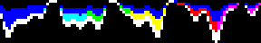 | Northern lights: overlapping sine waves drive curtain height and sway, GLOW brightness from leading edge up, hue drifting across the width via SPECTRUM. Seamless. 53 frames at 120ms. |
| `maze` | 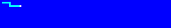 | Recursive backtracker carving a 48×8-cell maze in real time. Blue walls, black passages, white carver head with a cyan trail. 53 frames at 80ms. |
| `ripples` | 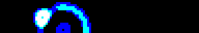 | Seven staggered water drops sending concentric ring ripples that interfere constructively; brightness quantized through the GLOW ramp. Seamless. 53 frames at 80ms. |
| `fireflies` | 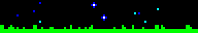 | ~12 fireflies drifting over an irregular green grass silhouette, each pulsing independently through the GLOW ramp. Seamless. 53 frames at 120ms. |
| `waveform` | 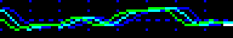 | Oscilloscope: a three-sine composite waveform morphing each frame, blue dot grid, dashed center line, phosphor persistence trail fading green → cyan → blue. Seamless. 53 frames at 60ms. |
| `coral` | 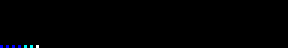 | Diffusion-limited aggregation growing branching coral structures from the bottom up; growth front white, recent cyan, established blue. 53 frames at 100ms. |

### Text-Em-All

| Animation | Preview | Description |
| --- | --- | --- |
| `tea_heartbeat` | 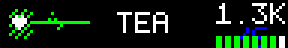 | Company pulse: a beating heart glyph synced with a messages-per-second counter, "TEA" steady in the center. 53 frames at 100ms. |
| `tea_network` | 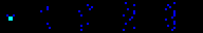 | Mass messaging as a network effect: one sender's message cascades exponentially through four columns of recipients, each generation a different color, ending with a synchronized pulse. 53 frames at 90ms. |
| `tea_uptime` |  | Service uptime monitor: "99.99%" types in, a 30-day status row fills (mostly green, a couple yellow), then "ALL SYSTEMS GO" wipes in. 53 frames at 100ms. |

## Claude Haiku 5.5

Created 2026-10-09, all 53 frames at 30,528 bytes except `ferris_wheel` (24
frames), so send the 53-frame ones with `--command-timeout 8`. Each was drafted
and checked by decoding the written file to text frames and reading them;
none has been tried on hardware.

### Free choice

| Animation | Preview | Description |
| --- | --- | --- |
| `ferris_wheel` | 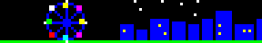 | A night fairground wheel turning over a seeded skyline: eight cabins in yellow, magenta, cyan, red, green and white, moving one cabin-spacing per loop with each cabin kept upright. White bulbs chase round the rim and stars twinkle over the city. 24 frames at 90ms. Seamless. |
| `morse_code` | 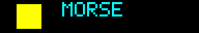 | HELLO sent by a signal lamp in real Morse timing: a dot is one frame lit, a dash three, one frame dark between symbols and three between letters. Dots flash yellow and dashes white, and each letter appears in the readout as its last symbol is sent. 53 frames at 110ms. |
| `lava_lamp` | 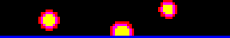 | Three wax blobs as metaballs, the field r² over distance² quantized into RED, MAGENTA and YELLOW from edge to hot core, rising and sinking over a blue heater glow. Each blob's height and sway follow the loop's one period. 53 frames at 90ms. Seamless. |
| `typewriter` | 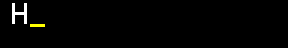 | HELLO WORLD and then LOOK AT ME, typed a character a frame with a yellow underline cursor. Each line feed rings the bell, flashing the border red, then the page rolls up and away one row a frame. 53 frames at 110ms. Not seamless: the page is blank at both ends. |
| `paper_plane` | 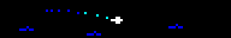 | A white paper plane flying a figure eight, turning to face its direction of travel, with a trail of its last eight positions fading cyan to blue. Clouds drift past at a rate that wraps exactly once per loop. 53 frames at 80ms. Seamless. |
| `hot_air_balloon` | 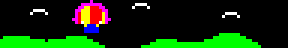 | A red and yellow striped balloon, shaded at its edge in magenta, drifting and bobbing on one loop period above a blue basket on ropes. White clouds pass over rolling green hills. 53 frames at 110ms. Seamless. |
| `binary_clock` | 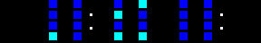 | The time as BCD: each decimal digit is a column of four squares, weight 8 at the top to 1 at the bottom, lit cyan for a one and dim blue for a zero. It counts from 10:59:00 at one real second a frame, with the colon dots blinking on even seconds, so the loop is 53 seconds long and wraps to 10:59:00. 53 frames at 1000ms. |
| `jellyfish` | 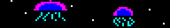 | Two jellies, a large and a small, pulsing their magenta-rimmed bells and drifting on their own phases, each with four cyan tentacles that travel in waves. White bubbles climb a full panel per loop. 53 frames at 100ms. Seamless. |
| `coin_flip` | 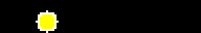 | A yellow coin tossed from the ground, spinning four times in the air with its width scaled by the cosine of its angle, then resting heads up as HEADS and 4 SPINS appear. The loop resets to the coin on the ground. 53 frames at 80ms. |
| `tic_tac_toe` | 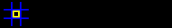 | A drawn game played out on the board: each move shows a yellow cursor on its cell for two frames, then places a red X or a cyan O. Once the board fills, DRAW blinks in the margin. 53 frames at 260ms. |
